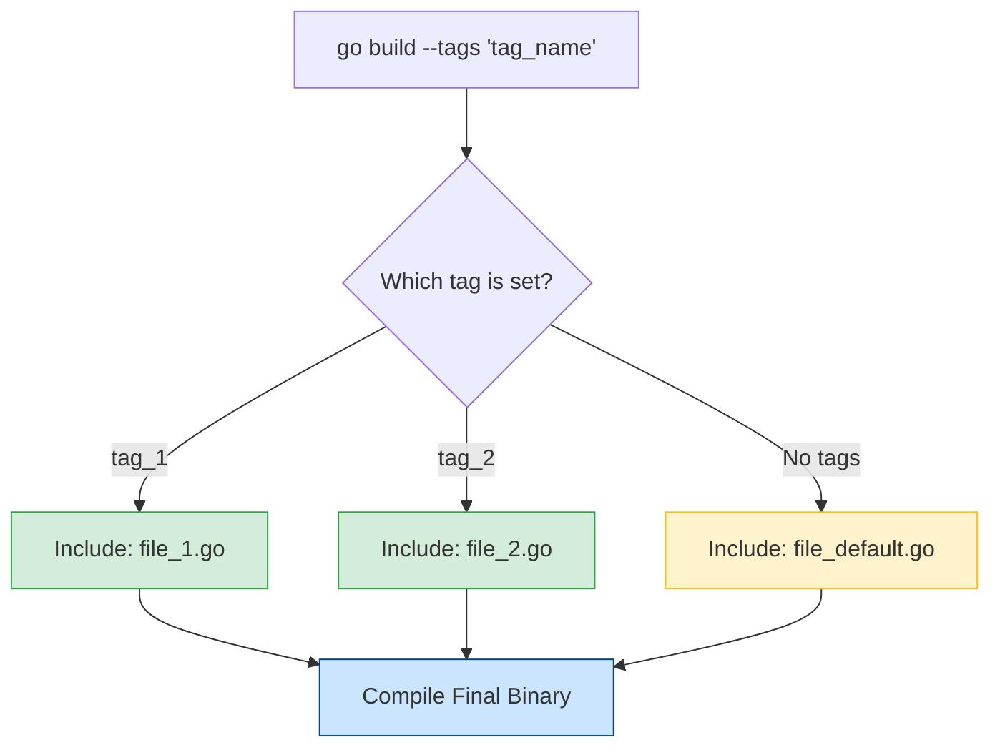

# 🏷️ Go Build Tags (Build Constraints)

Build tags are a powerful feature in Go that allow you to conditionally include or exclude files from the compilation process. This is essential for cross-platform development, feature flagging, and separating different types of tests.

---

## 1. Core Concepts

| Concept | Description / Purpose |
| :--- | :--- |
| **`//go:build`** | The modern (Go 1.17+) directive used to define build constraints at the top of a file. |
| **Boolean Logic** | Tags support complex logic using `&&` (AND), `||` (OR), and `!` (NOT). |
| **File Suffixes** | Go automatically handles files like `_linux.go` or `_windows.go` without explicit tags. |
| **Custom Tags** | Arbitrary strings passed via the `--tags` flag during `go build` or `go run`. |

---

## 2. 🖼️ Visual Representation

The compiler filters files based on the tags provided during the build command.



---

## 3. 📝 Implementation Examples

### Syntax (Go 1.17+)

The directive must be at the very top of the file, followed by a blank line before the package declaration.

```go
//go:build (linux || darwin) && cgo
// +build !windows

package mypackage
```

---

## 4. 🚀 Common Patterns & Use Cases

- **🌐 OS Specifics**: Handling platform-specific syscalls or file paths (e.g., `//go:build windows`).
- **🧪 Integration Testing**: Separating heavy tests from unit tests (e.g., `//go:build integration`).
- **🚩 Feature Flags**: Including experimental features in specific builds (e.g., `//go:build experimental`).

---

## 5. ⚠️ Critical Pitfalls & Best Practices

> [!WARNING]
> Build tags MUST have a blank line between the constraint and the `package` declaration. Failure to do so will cause the compiler to ignore the tag.

1. **Placement**: Always place tags at the absolute top of the file (line 1).
2. **Legacy Support**: While `//go:build` is preferred, consider including the legacy `// +build` syntax if you need to support Go versions older than 1.17.
3. **Naming**: Use clear, descriptive names for custom tags to avoid collisions with OS/Arch names.

---

## 🧪 Running the Examples

Try running the demo code with different tags to see how the output changes:

```bash
# Run with tag 1
go run --tags buildTagsDemo_1 main.go

# Run with tag 2
go run --tags buildTagsDemo_2 main.go

# Run the default implementation (no tags)
go run main.go
```

---

## 📚 Further Reading

- [Go Documentation: Build Constraints](https://pkg.go.dev/go/build#hdr-Build_Constraints)
- [Customising Go Binaries with Build Tags](https://www.digitalocean.com/community/tutorials/customizing-go-binaries-with-build-tags)
