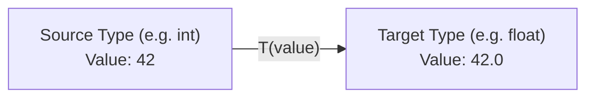
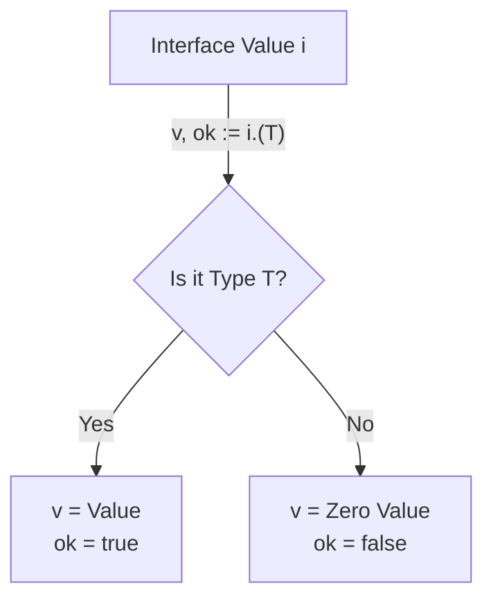

# 🔄 Type Conversion & Assertion in Go

In Go, types are strict. There are two primary ways to interpret or change types: **Type Conversion** for concrete-to-concrete transitions and **Type Assertion** for interface-to-concrete extractions.

---

## 1. Core Concepts

| Concept | Description / Purpose |
| :--- | :--- |
| **Type Conversion** | Converting between compatible concrete types (e.g., `int` to `float64`). |
| **Type Assertion** | Extracting a concrete value from an interface (e.g., `i.(string)`). |
| **Type Switch** | A clean way to handle multiple possible types for an interface value. |
| **Implicit Conversion** | **Non-existent in Go**. Even compatible types like `int32` and `int` require manual conversion. |

---

## 2. 🖼️ Visual Representation

### Type Conversion (Concrete to Concrete)


### Type Assertion (Interface to Concrete)


---

## 3. 📝 Implementation Examples

### Conversion vs. Assertion

```go
// 1. Concrete Conversion
var x int = 10
var y float64 = float64(x) // Required: No implicit casting

// 2. Interface Assertion
var i interface{} = "hello"

s, ok := i.(string) // Safe: returns (value, bool)
if ok {
    fmt.Println(s)
}

// 3. Type Switch
switch v := i.(type) {
case string:
    fmt.Println("It's a string:", v)
case int:
    fmt.Println("It's an int:", v)
}
```

---

## 4. 🚀 Common Patterns & Use Cases

- **Numeric Precision**: Converting between `int` and `float64` for mathematical calculations.
- **Dynamic Content**: Using `interface{}` (or `any`) to handle JSON of unknown structure and asserting specific fields.
- **Polymorphism**: Using type switches to provide specific logic for different implementations of a common interface.

---

## 5. ⚠️ Critical Pitfalls & Best Practices

> [!WARNING]
> Unsafe type assertions like `s := i.(string)` (without the `ok` check) will **PANIC** if the interface does not hold the expected type. Always use the "comma, ok" idiom.

1. **Precision Loss**: Be careful when converting `float64` to `int` (truncation) or `int64` to `int32` (overflow).
2. **Prefer Type Switches**: For handling multiple types, type switches are cleaner and more idiomatic than a series of `if-else` assertions.
3. **Minimize `interface{}`**: Only use empty interfaces when truly necessary; Go's strength lies in its static typing.

---

## 🧪 Running the Examples

Explore the unit tests for runnable patterns covering numeric conversions and interface assertions.

```bash
# Run tests for conversion and assertion
go test -v ./internal/basics/casting/...
```

---

## 📚 Further Reading

- [A Tour of Go: Type Conversions](https://go.dev/tour/basics/13)
- [A Tour of Go: Type Assertions](https://go.dev/tour/methods/15)
