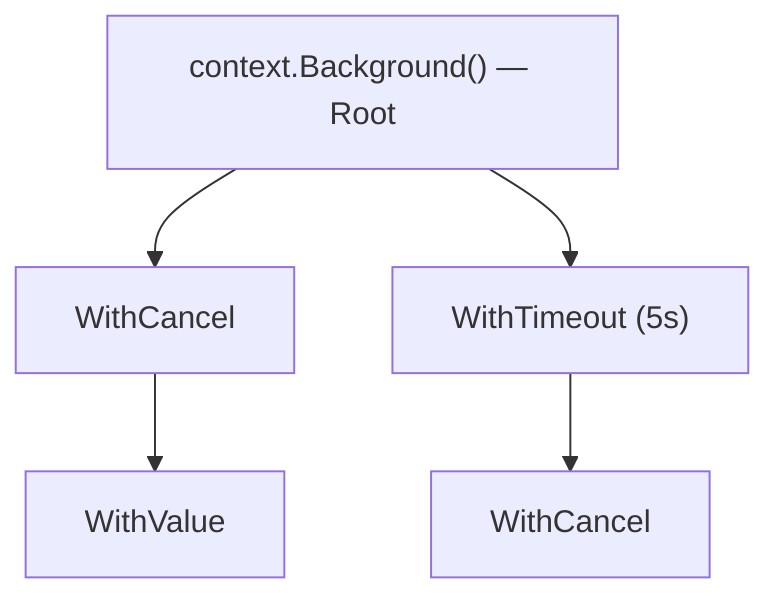

# 🌐 Context in Go (`context`)

The `context` package is one of Go's most important tools for managing **cancellation**, **deadlines**, and **request-scoped values** across API boundaries and between goroutines.

---

## 1. Core Concepts

| Concept | Description / Purpose |
| :--- | :--- |
| **`Context` Interface** | A thread-safe object that carries deadlines and signals cancellation. |
| **Cancellation** | Propagating a "stop" signal down the call tree to release resources. |
| **Deadlines / Timeouts** | Automatically cancelling a process after a specific time or duration. |
| **Request Values** | Carrying metadata like Trace IDs or User Auth through a call graph. |

---

## 2. 🖼️ Visual Representation

### The Context Tree
Contexts are hierarchical. When a parent context is cancelled, all contexts derived from it are also cancelled.



---

## 3. 📝 Implementation Examples

### Standard Cancellation Pattern

```go
func DoWork(ctx context.Context) error {
    for {
        select {
        case <-ctx.Done():
            // Context was cancelled or timed out
            return ctx.Err()
        default:
            // Continue working
            processNextItem()
        }
    }
}
```

### Modern Testing with `t.Context()` (Go 1.24+)

```go
func TestMyService(t *testing.T) {
    ctx := t.Context() // Automatically cancelled when test completes
    err := CallAPI(ctx)
    assert.NoError(t, err)
}
```

---

## 4. 🚀 Common Patterns & Use Cases

- **HTTP Request Lifecycle**: Using the request context to abort database queries if the user disconnects.
- **Microservice Tracing**: Passing a `TraceID` via `context.WithValue` to link logs across multiple services.
- **Graceful Shutdown**: Signaling background workers to stop when the main application receives an interrupt signal.

---

## 5. ⚠️ Critical Pitfalls & Best Practices

> [!WARNING]
> If you create a `WithTimeout` context and don't call `cancel()`, the timer will keep running until it expires, causing a **Goroutine Leak**. Always `defer cancel()`.

1. **Pass as First Argument**: Context should always be the first parameter: `func Do(ctx context.Context, ...)`.
2. **Don't Store in Structs**: Pass context explicitly through function calls to keep the execution path clear.
3. **Values for Metadata Only**: Never use `WithValue` for passing optional parameters; it's for request-scoped data (Auth, Tracing) only.
4. **Context is Immutable**: You never modify a context; you always derive a new child from a parent.

---

## 🧪 Running the Examples

Explore the unit tests for runnable patterns covering cancellation, timeouts, and the new `t.Context()` helper.

```bash
# Run tests for context patterns
go test -v ./internal/basics/context/...
```

---

## 📚 Further Reading

- [Official Go Blog: Go Concurrency Patterns: Context](https://go.dev/blog/context)
- [Go Documentation: Package context](https://pkg.go.dev/context)
