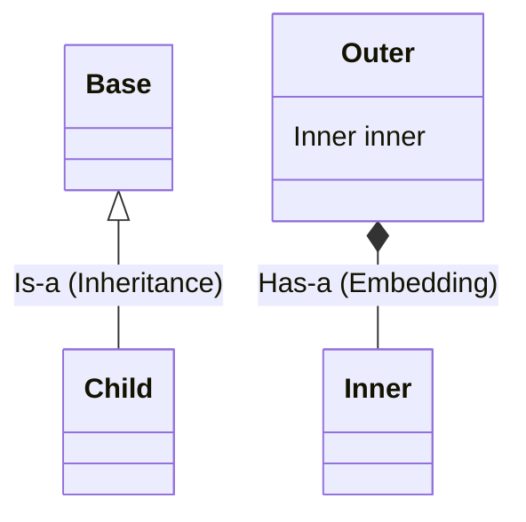
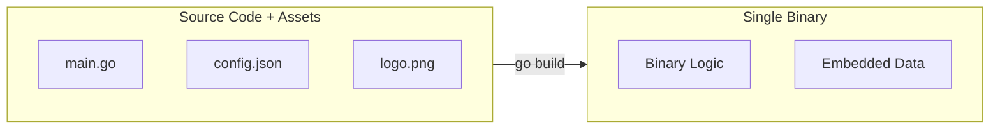

# 📦 Embedding in Go

Go uses the term "embedding" for two distinct features: **Struct Embedding** (composition) and the **`go:embed` directive** (static assets). Both simplify code structure and deployment.

---

## 1. Core Concepts

| Concept | Description / Purpose |
| :--- | :--- |
| **Struct Embedding** | Composing structs by including one inside another without a field name. |
| **Method Promotion** | Embedded fields and methods "surface" to the outer struct automatically. |
| **`go:embed`** | A compiler directive to include static files directly into the compiled binary. |
| **`embed.FS`** | A read-only virtual filesystem for managing multiple embedded files. |

---

## 2. 🖼️ Visual Representation

### Struct Embedding (Composition)
Unlike inheritance, embedding is about "has-a" relationships that look like "is-a".



### File Embedding


---

## 3. 📝 Implementation Examples

### Struct Embedding

```go
type Logger struct {}
func (l Logger) Log(msg string) { fmt.Println(msg) }

type Service struct {
    Logger // Anonymous embedding
}

s := Service{}
s.Log("Service started") // Promoted method!
```

### File Embedding

```go
import "embed"

//go:embed version.txt
var version string

//go:embed static/*
var content embed.FS
```

---

## 4. 🚀 Common Patterns & Use Cases

- **Composition over Inheritance**: Building complex types by combining smaller, reusable structs.
- **Zero-Dependency Binaries**: Embedding HTML templates, CSS, or SQL migrations into the binary for easier deployment.
- **Interface Satisfaction**: Embedding an interface in a struct to "mock" only the methods needed for a specific test.

---

## 5. ⚠️ Critical Pitfalls & Best Practices

> [!WARNING]
> Embedded files are **Read-Only** at runtime. You cannot modify them without recompiling the binary.

1. **Shadowing**: If both the outer and inner structs have a field with the same name, the outer one wins.
2. **Not Subtyping**: An `Admin` struct that embeds a `User` is **NOT** a `User` type; you cannot pass it to a function expecting `User`.
3. **Import Required**: Even if you don't use `embed.FS`, you must `import _ "embed"` for the directive to work.
4. **Global Scope**: `//go:embed` only works on package-level variables, not inside functions.

---

## 🧪 Running the Examples

Explore the unit tests for runnable patterns covering struct composition and the `go:embed` directive.

```bash
# Run tests for embedding patterns
go test -v ./internal/basics/embed/...
```

---

## 📚 Further Reading

- [Effective Go: Embedding](https://go.dev/doc/effective_go#embedding)
- [Go Blog: Package embed](https://go.dev/blog/embed)
