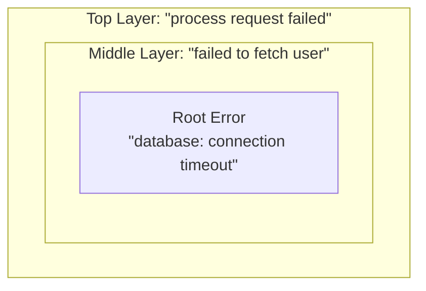

# ⚠️ Error Handling in Go

Errors in Go are values, not exceptions. They are treated as first-class citizens and returned alongside function results. This encourages explicit handling and makes control flow predictable.

## 📌 Why handle Errors this way?
- **Explicit Handling**: You cannot ignore errors by accident; the compiler makes you acknowledge them.
- **Traceability**: Wrapping errors creates a "stack trace" of your own domain logic.
- **Predictability**: No hidden control flow (like `try-catch`) that could jump across your code.
- **Value-Based**: You can compare, check, and manipulate errors just like any other variable.

---

## 🏗️ How Error Wrapping Works

When an error happens deep in your code, you "wrap" it with more context as it moves up the stack.


**Full wrapped error string**
```
process request failed: failed to fetch user: database: connection timeout
|---------------------| |-------------------| |--------------------------|
          TOP                  MIDDLE                    ROOT

```
---

## ✍️ Anatomy of Error Handling

Errors must satisfy the `error` interface: `type error interface { Error() string }`.

```go
// 1. Sentinel Error (package level constant-like error)
var ErrNotFound = errors.New("not found")

// 2. Custom Error Type (struct that implements error)
type MyError struct {
    Code int
    Msg  string
}
func (e *MyError) Error() string { return e.Msg }

// 3. Wrapping and Checking
func DoSomething() error {
    err := callDB()
    if err != nil {
        return fmt.Errorf("failed to do something: %w", err) // %w wraps the error
    }
    return nil
}
```

---

## 🏃 Error Operations

| Command | Description |
|---------|-------------|
| `errors.Is(err, ErrNotFound)` | Check if a specific **sentinel error** is in the chain. |
| `errors.As(err, &myErr)` | Check if a specific **error type** is in the chain. |
| `fmt.Errorf("... %w", err)` | **Wrap** an error with context (preserves the original). |
| `errors.Join(err1, err2)` | **Combine** multiple errors into one (Go 1.20+). |

---

## 💡 Pro Tips for Starters

### 1. Don't use `%v` for errors
If you use `fmt.Errorf("... %v", err)`, the original error is lost and you can't use `errors.Is` or `errors.As`. **Always use `%w`**.

### 2. Check for Errors First (Happy Path)
Try to handle errors and return early. This keeps the "happy path" of your code at the left margin, making it easier to read.

### 3. Sentinel vs. Custom Type
- Use **Sentinel Errors** (`var Err...`) for simple, static error messages.
- Use **Custom Types** (`type ...Error struct`) when you need to attach extra data (like HTTP codes or field names).

---

## 🛠️ Practical Examples

The [`errors.go`](errors.go) file contains runnable examples you can read and explore:

| Function | Demonstrates |
|----------|-------------|
| `LookupUser` | Returning and wrapping a sentinel error with `%w`. |
| `GreetUser` | Calling a function and checking the error with `if err != nil`. |

The [`errors_test.go`](errors_test.go) file tests every function and shows additional patterns:
- **Basic Error Checking**: `if err != nil` and reading the error message.
- **Sentinel Errors**: Direct comparison vs `errors.Is`.
- **Custom Error Types**: Structured error data with `errors.As`.
- **`errors.Is`**: Walking the wrap chain for sentinels.
- **`errors.As`**: Walking the wrap chain for custom types.
- **`errors.Join`**: Combining multiple errors (Go 1.20+).
- **Panic & Recover**: Handling catastrophic failures (rarely used).

**Run the tests to see it all in action!**
```bash
cd internal/basics/err
```
```bash
go test -v ./...
```

## Your Next Step
Once you can handle errors effectively, you're ready to start building more complex, real-world data structures.
Explore **[Entities & Structs](../entity/README.md)** to learn how to define and initialize your domain objects.

---

## 📚 Best Practices

- **Naming**: Sentinel errors start with `Err` (e.g., `ErrNotFound`).
- **Naming**: Custom error types end with `Error` (e.g., `ValidationError`).
- **Return Pattern**: Always return the error as the last return value.
- **Never Ignore**: Do not use `_ = someFunc()` if it returns an error.

