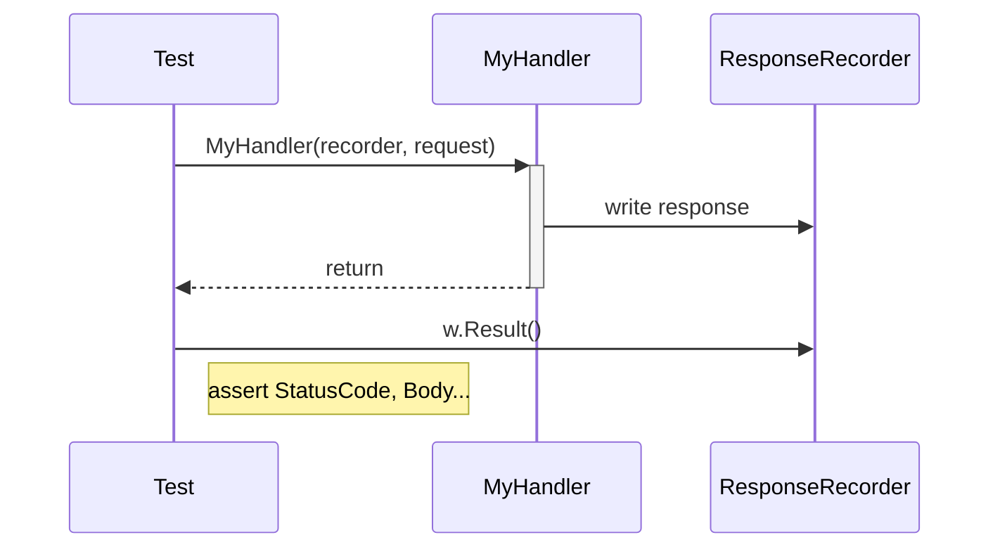

# 🧪 HTTP Testing in Go

`net/http/httptest` provides two complementary tools: a **recorder** to unit-test handlers in isolation, and a **test server** to integration-test HTTP clients against a real (ephemeral) server.

---

## 1. Core Concepts

| Concept | Description / Purpose |
| :--- | :--- |
| **`httptest.NewRecorder()`** | Captures a handler's response in memory. Used to unit-test handlers directly — no network involved. |
| **`httptest.NewRequest()`** | Creates a synthetic `http.Request` for passing directly to a handler. |
| **`w.Result()`** | Returns the final `http.Response` captured by a recorder. |
| **`httptest.NewServer()`** | Spawns a real, ephemeral HTTP server on a random port. Used to integration-test HTTP clients. |
| **`ts.URL`** | The base URL of the ephemeral server (e.g. `http://127.0.0.1:PORT`). |

---

## 2. 🗺️ Visual Representation

### Recorder — Handler Unit Test


### Test Server — Client Integration Test
```mermaid
sequenceDiagram
    participant T as Test
    participant S as httptest.NewServer()
    participant C as http.Client

    T->>+S: spawn server (ts.URL)
    T->>C: http.Get(ts.URL)
    C->>S: HTTP request
    S-->>C: HTTP response
    C-->>T: resp, err
    Note right of T: assert StatusCode, Body...
    T->>-S: ts.Close()
```

---

## 3. 💻 Implementation Examples

### Recorder
```go
func TestHandlerUsingRecorder(t *testing.T) {
    // 1. Initialisation
    req := httptest.NewRequest(http.MethodGet, "https://example.com/foo", strings.NewReader("input"))
    w := httptest.NewRecorder()

    // 2. Execution
    MyHandler(w, req)
    res := w.Result()
    defer res.Body.Close()

    // 3. Finalisation (Verification)
    assert.Equal(t, http.StatusOK, res.StatusCode)
    assert.Equal(t, "val", res.Header.Get("key"))
}
```

### Test Server
```go
func TestMockServerResponse(t *testing.T) {
    // 1. Initialisation
    ts := httptest.NewServer(http.HandlerFunc(func(w http.ResponseWriter, r *http.Request) {
        _, err := w.Write([]byte("hello"))
        assert.NoError(t, err)
    }))
    defer ts.Close()

    // 2. Execution
    res, err := http.Get(ts.URL)
    assert.NoError(t, err)
    defer res.Body.Close()

    // 3. Finalisation (Verification)
    body, err := io.ReadAll(res.Body)
    assert.NoError(t, err)
    assert.Equal(t, "hello", string(body))
}
```

---

## 4. 📋 Common Patterns & Use Cases

- **Handler Unit Tests**: Use `NewRecorder` + `NewRequest` to test a single handler function in complete isolation — no port, no goroutine, no teardown.
- **Client Integration Tests**: Use `NewServer` to stand up a real HTTP server and exercise your `http.Client` code end-to-end, including middleware, JSON encode/decode, and headers.
- **Non-2xx Responses**: Verify that your client correctly inspects `resp.StatusCode` — a 400 or 500 from `http.Get` is **not** a Go error.

---

## 5. ⚠️ Critical Pitfalls & Best Practices

> [!WARNING]
> A non-2xx HTTP response (400, 500, etc.) does **not** set `err != nil`. Always check `resp.StatusCode` explicitly after checking `err`.

1. **Always `defer ts.Close()`**: Failing to close a test server leaks the goroutine and port for the duration of the test run.
2. **Always `defer resp.Body.Close()`**: Even in tests, unclosed bodies hold connections open and can cause subtle failures in parallel test runs.
3. **Recorder for handlers, server for clients**: Use `NewRecorder` when you own the handler and want pure unit tests. Use `NewServer` when you want to test the full HTTP round-trip of your client code.

---

## 🏃 Running the Examples

Explore the unit tests for runnable patterns:
- `httptest_test.go`: Recorder-based handler tests, JSON POST, non-2xx status codes, and custom headers via test server.

```bash
# Run tests with verbose output
go test -v ./internal/basics/httptest/...
```

---

## 📚 Further Reading

- [Official Go Documentation: net/http/httptest](https://pkg.go.dev/net/http/httptest)
- [Go Blog: The HTTP Handler](https://go.dev/doc/articles/wiki/)
