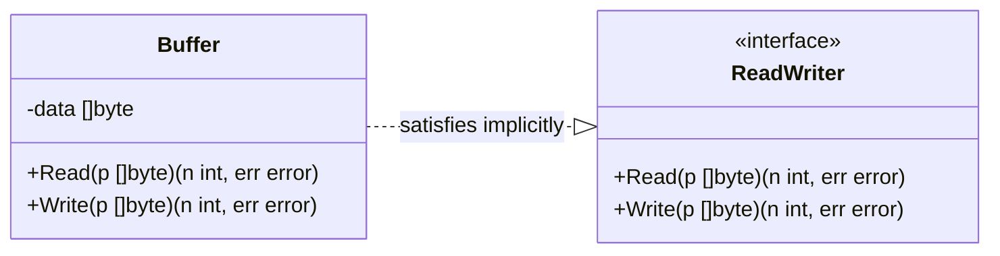

# 🔌 Interfaces in Go

Interfaces in Go define behavior. They are satisfied implicitly, enabling powerful decoupling and abstraction without explicit inheritance.

---

## 1. Core Concepts

| Concept | Description / Purpose |
| :--- | :--- |
| **Interface** | A set of method signatures that define a contract. |
| **Implicit Implementation** | A type implements an interface by simply implementing its methods. |
| **Interface Composition** | Building larger interfaces by embedding smaller ones. |
| **Empty Interface (`any`)** | An interface with no methods, satisfied by any value. |

---

## 2. 🗺️ Visual Representation



> [!INFO}
> Functions can accept `ReadWriter` rather than `Buffer` directly — any type implementing the
> interface works, without the knowing the concrete type.

---

## 3. 💻 Implementation Examples

```go
// 1. Definition (Embedded interfaces)
type ReadWriter interface {
    io.Reader
    io.Writer
}

// 2. Concrete Implementation (Implicit)
type Buffer struct {
    data []byte
}
func (b *Buffer) Read(p []byte) (n int, err error) { /* ... */ }
func (b *Buffer) Write(p []byte) (n int, err error) { /* ... */ }

// 3. Usage
func Process(rw ReadWriter) error {
    // Functions can accept interfaces, allowing any implementing type
    return nil
}
```

---

## 4. 📋 Common Patterns & Use Cases

- **Producer Side vs Consumer Side**: Defining interfaces where they are produced (like `io.Reader`) vs where they are consumed to decouple dependencies.
- **Mocking for Tests**: Creating interface-based dependencies that can be easily swapped for mocks in unit tests.
- **The Empty Interface**: Using `any` (formerly `interface{}`) to handle values of unknown types.

---

## 5. ⚠️ Critical Pitfalls & Best Practices

> [!WARNING]
> Do not over-abstract. "Don't design with interfaces, discover them." — Rob Pike. Start with concrete types and introduce interfaces only when multiple implementations are needed.

1. **Small Interfaces**: Keep interfaces small and focused (e.g., `io.Reader` has only one method).
2. **Interface Pollution**: Avoid defining interfaces for every struct. Use them only when you need to decouple from a specific implementation.
3. **Pointers to Interfaces**: Almost never use a pointer to an interface (`*Interface`). Interfaces themselves are already reference-like values.

---

## 🏃 Running the Examples

Explore the unit tests for runnable patterns:
- `embedding/embedding_test.go`: Shows how to compose interfaces.
- `consumerside/consumer/consumer_test.go`: Shows why we define interfaces on the consumer side.

```bash
# Run tests with verbose output
go test -v ./internal/basics/interface/...
```

---

## 📚 Further Reading

- [Official Go Documentation: Interfaces](https://go.dev/doc/effective_go#interfaces)
- [Code Review Comments: Interfaces](https://github.com/golang/go/wiki/CodeReviewComments#interfaces)
