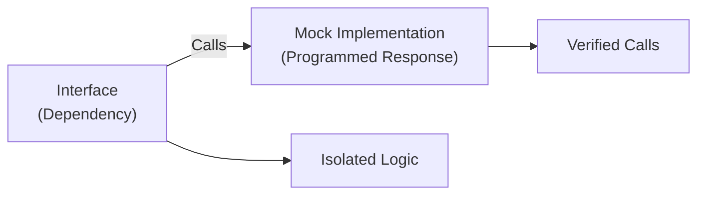

# 🎭 Mocking in Go

Mocking allows isolating units under test by providing controlled implementations of interface dependencies, essential for robust unit testing.

---

## 1. Core Concepts

| Concept | Description / Purpose |
| :--- | :--- |
| **Mockery** | Tool that generates mocks for Go interfaces using the `testify` framework. |
| **Go Mock (uber/mock)** | Official reflection-based mocking framework, part of the `uber-go` suite. |
| **Type-Safe Expectations** | Catching signature changes at compile-time with `EXPECT()`. |
| **Argument Matching** | Specifying rules for function arguments (e.g., `mock.Anything`). |

---

## 2. 🗺️ Visual Representation



---

## 3. 💻 Implementation Examples

```go
func ExampleFunction(adder calculator.Adder, x int, y int) (int, error) {
    // 1. Initialisation (Using dependency injection)
    result, err := adder.SingleDigitAdd(x, y)
    
    // 2. Execution
    return result, err
}

// 3. Test setup (with Mockery)
mockAdder := new(mocks.Adder)
mockAdder.On("SingleDigitAdd", 1, 2).Return(3, nil)
```

---

## 4. 📋 Common Patterns & Use Cases

- **Decoupling Packages**: Providing mocked versions of databases, external APIs, or complex business logic.
- **Error Simulation**: Forcing a dependency to return an error to test your application's error handling.
- **Verification of Calls**: Ensuring that a specific function was called with the correct parameters.

---

## 5. ⚠️ Critical Pitfalls & Best Practices

> [!WARNING]
> Only mock interfaces you OWN. Mocking third-party libraries leads to fragile tests that break when external code changes. Use `httptest` or real instances for external libraries instead.

1. **Keep Mocks Simple**: Don't build complex logic into your mocks. They should only return predefined values or simple errors.
2. **Prefer Mockery with Testify**: For consistency with the rest of the project, we use Mockery to keep our tests concise and readable.
3. **Use Mockery v2+**: Always prefer the type-safe `EXPECT()` API to catch signature changes at compile time.

---

## 🏃 Running the Examples

Explore the unit tests for runnable patterns:
- `example_test.go`: Shows how to use generated mocks in a real test.

```bash
# Run tests with verbose output
go test -v ./internal/basics/mocking/...
```

---

## 📚 Further Reading

- [Mockery: Documentation](https://github.com/vektra/mockery)
- [Uber Mock: Documentation](https://github.com/uber-go/mock)
