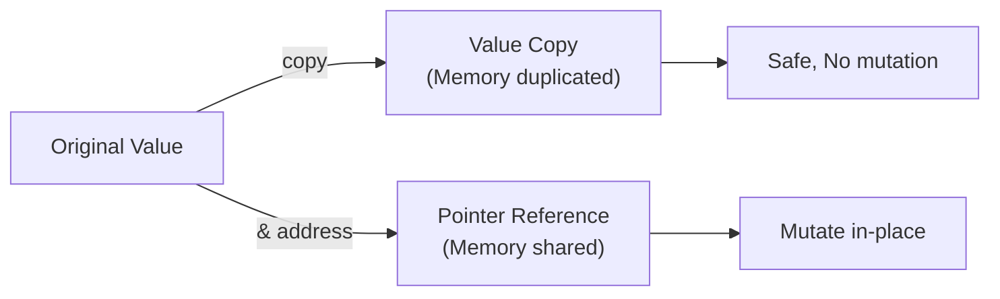

# 📥 Function Parameters in Go

Go is a pass-by-value language. Choosing between value and pointer parameters affects memory usage, mutability, and nil safety.

---

## 1. Core Concepts

| Concept | Description / Purpose |
| :--- | :--- |
| **Pass-by-Value** | Function receives a copy of the argument; original is unchanged. |
| **Pass-by-Reference (via Pointer)** | Function receives the memory address; can mutate the original. |
| **Value Parameter** | Best for small types (int, string, small structs) and when mutability is unwanted. |
| **Pointer Parameter** | Necessary for mutability or when copying large objects is expensive. |

---

## 2. 🗺️ Visual Representation



---

## 3. 💻 Implementation Examples

```go
// 1. Value parameter (Safe, makes a copy)
func valueParameter(c Currency, n int) []Currency {
    var arr []Currency
    for i := 0; i < n; i++ {
        arr = append(arr, c) // Copying c each time
    }
    return arr
}

// 2. Pointer parameter (Efficient for large data, shared)
func pointerParameter(c *Currency, n int) []*Currency {
    var arr []*Currency
    for i := 0; i < n; i++ {
        arr = append(arr, c) // Sharing the address of c
    }
    return arr
}
```

---

## 📋 4. Common Patterns & Use Cases

- **Large Struct Optimization**: Passing pointers to avoid expensive memory copying of giant data structures.
- **Mutual Updates**: When a function must change the state of a passed-in object (e.g., `UpdateUser(u *User)`).
- **Nil as Optional**: Using pointers to allow a `nil` value, effectively making the parameter optional.

---

## ⚠️ 5. Critical Pitfalls & Best Practices

> [!WARNING]
> Pointers introduce the risk of nil-pointer dereferences (panics). Always check for nil when a pointer is passed as an argument.

1. **Don't Blindly Use Pointers**: Pointers are not always faster due to garbage collection overhead and potential heap allocation.
2. **Value Safety**: Use value parameters for small types (ints, bools, strings) and when you want to guarantee that a function won't change your data.
3. **Consistency**: If a struct has pointer methods, use pointers for that struct consistently.

---

## 🏃 Running the Examples

Explore the benchmarks to see performance differences:
- `parameters_test.go`: Compare performance of value vs pointer parameters under load.

```bash
# Run benchmarks with memory statistics
go test -bench '.Parameter.' -benchmem ./internal/basics/parameters/...
```

---

## 📚 Further Reading

- [Effective Go: Pointers vs Values](https://go.dev/doc/effective_go#pointers_vs_values)
- [Go Wiki: Code Review Comments (Pointers)](https://github.com/golang/go/wiki/CodeReviewComments#receiver-type)
