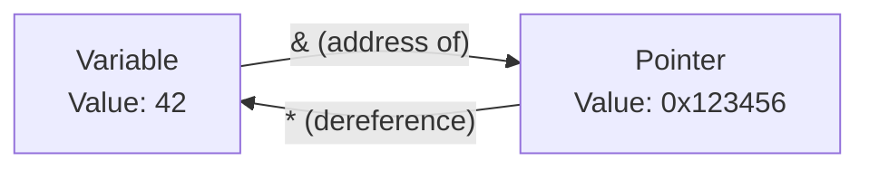

# 📍 Pointers in Go

A pointer holds the memory address of a value. Go uses pointers to share and mutate data across function boundaries efficiently.

---

## 1. Core Concepts

| Concept | Description / Purpose |
| :--- | :--- |
| **Address (`&`)** | Operator used to get the memory address of a value. |
| **Dereference (`*`)** | Operator used to access or mutate the value at a memory address. |
| **Nil Pointer** | A pointer with no value (points to address 0). Accessing its value causes a panic. |
| **Pass-by-Pointer** | Sharing a value between functions without copying. |

---

## 2. 🗺️ Visual Representation



---

## 3. 💻 Implementation Examples

### Basic Instantiation
```go
func InstantiationExamples() {
    // 1. Using new() to allocate zeroed memory
    p := new(int) // p is *int, *p is 0
    *p = 42       // set the value at the allocated address

    // 2. Using the address-of operator (&) on a variable
    x := 100
    ptr := &x     // ptr is *int pointing to x

    // 3. Using & with struct literals (idiomatic)
    c := &Counter{count: 10} // Allocates and initializes in one step
}
```

### Modifying State
```go
func IncrementPointer(n *int) {
    // 1. Initialisation (Address received as argument)
    
    // 2. Execution (Dereferencing to mutate)
    *n++
}

func ExampleUsage() {
    x := 10
    IncrementPointer(&x) // Passing address
    fmt.Println(x) // x is now 11
}
```

---

## 📋 4. Common Patterns & Use Cases

- **Mutation**: Mutating a variable defined outside the current function.
- **Efficiency**: Avoiding copies of large structs (though not always faster).
- **Optional Values**: Representing an absent value using a nil pointer.

---

## ⚠️ 5. Critical Pitfalls & Best Practices

> [!WARNING]
> Dereferencing a nil pointer (`*ptr` when `ptr == nil`) causes a runtime panic. Always check for nil before dereferencing if the pointer could be nil.

1. **Safety**: Go's GC handles memory, so returning a pointer to a local variable is perfectly safe (it "escapes" to the heap).
2. **Value Semantics**: Use value parameters for small types (e.g., `int`, `bool`, `string`) as the overhead of a pointer isn't worth it.
3. **Struct Mutability**: If a struct method needs to mutate its receiver, it must use a pointer receiver (`func (s *MyStruct) Mutate()`).

---

## 🏃 Running the Examples

Explore the unit tests for runnable patterns:
- `pointers_test.go`: Coverage of value vs pointer behaviour and nil safety.

```bash
# Run tests with verbose output
cd internal/basics/pointers
```
```bash
go test -v ./...
```

---

## 📚 Further Reading

- [Official Go Tour: Pointers](https://go.dev/tour/moretypes/1)
- [Effective Go: Pointers vs. Values](https://go.dev/doc/effective_go#pointers_vs_values)
