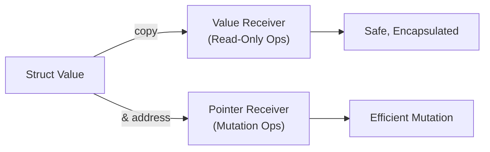

# 🎯 Method Receivers in Go

Methods in Go are functions with a receiver argument. Choosing between value and pointer receivers determines whether the method can mutate the receiver.

---

## 1. Core Concepts

| Concept | Description / Purpose |
| :--- | :--- |
| **Value Receiver** | Method receives a copy of the value; cannot mutate the original. |
| **Pointer Receiver** | Method receives the address of the value; can mutate the original. |
| **Methods** | Functions associated with a type, providing behavioural structure. |
| **Consistency** | The rule that all methods for a type should typically use the same receiver style. |

---

## 2. 🗺️ Visual Representation



---

## 3. 💻 Implementation Examples

```go
type Counter struct{ count int }

// 1. Value receiver (Read-only)
func (c Counter) Value() int {
    return c.count
}

// 2. Pointer receiver (Mutation)
func (c *Counter) Increment() {
    // 3. Execution (Modifies original)
    c.count++
}
```

---

## 📋 4. Common Patterns & Use Cases

- **Mutation**: When a method must change a field in the struct (use pointer receiver).
- **Concurrency**: Methods involving `sync.Mutex` must use a pointer receiver to avoid copying the lock.
- **Large Structs**: Using pointer receivers for large structs to avoid memory copies.

---

## ⚠️ 5. Critical Pitfalls & Best Practices

> **Warning:** Never copy a struct containing a `sync.Mutex`. Doing so copies the lock's state, leading to deadlocks or undefined behaviour. Use a pointer receiver to prevent accidental copies.

1. **Rule of Consistency**: If any method for a type must have a pointer receiver, make **all** methods pointer receivers.
2. **Small Types**: Use value receivers for small types (e.g., `int`, `string`, small structs like `time.Time`) that are naturally "value-like".
3. **Avoid Nil Receivers**: While Go allows calling methods on nil pointers, it often causes panics unless the method explicitly handles the nil case.

---

## 🏃 Running the Examples

Explore the unit tests for runnable patterns:
- `receivers_test.go`: Coverage of value vs pointer receiver behaviour and concurrency safety.

```bash
# Run tests with verbose output
cd internal/basics/receivers
```
```bash
go test -v ./...
```

## Your Next Step
With methods providing behavior to your types, you're ready to define contracts between types using interfaces.
Explore **[Interfaces in Go](../interface/README.md)** to master implicit implementation and decoupling.

---

## 📚 Further Reading

- [Effective Go: Pointers vs. Values](https://go.dev/doc/effective_go#pointers_vs_values)
- [Go Wiki: Code Review Comments (Receivers)](https://github.com/golang/go/wiki/CodeReviewComments#receiver-type)
