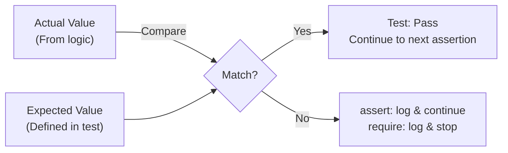

# ✅ Testify in Go

`testify` is a popular toolkit for Go testing, providing fluent assertions, mocking, and test suite structures.

---

## 1. Core Concepts

| Concept | Description / Purpose |
| :--- | :--- |
| **Assertions (`assert`)** | Readable functions to verify expectations. Continues test on failure. |
| **Requirements (`require`)** | Similar to `assert`, but halts the test immediately on failure. |
| **Suites (`suite`)** | Structured test groups with setup and teardown hooks. |
| **Mocks (`mock`)** | Hand-written or generated mocks for testing dependencies. |

---

## 2. 🗺️ Visual Representation



---

## 3. 💻 Implementation Examples

```go
// 1. Assertions
assert.Equal(t, expected, actual)
assert.NoError(t, err)

// 2. Halting on failure
require.NoError(t, err) // stops here if error occurs

// 3. Test Suites
type MyTestSuite struct{ suite.Suite }
func (s *MyTestSuite) TestSomething() { s.Equal(1, 1) }
func TestMyTestSuite(t *testing.T) { suite.Run(t, new(MyTestSuite)) }
```

---

## 📋 4. Common Patterns & Use Cases

- **Setup & Teardown**: Using suite hooks like `SetupTest()` to prepare data before each test case.
- **Error Comparison**: Using `assert.ErrorIs` for sentinel error checks and `assert.ErrorAs` for typed errors.
- **Fluent Verification**: Using `assert.Contains`, `assert.Len`, and `assert.ElementsMatch` for collection checks.

---

## ⚠️ 5. Critical Pitfalls & Best Practices

> [!WARNING]
> Use `require` for setup steps that are prerequisites for the rest of the test. Using `assert` in these cases leads to cascading, unhelpful failures.

1. **Clear Failure Messages**: Add custom error messages as arguments to `assert` functions to make failures easier to debug.
2. **Mock Interaction**: Combine `testify/mock` with generated mocks (e.g., Mockery) for powerful dependency verification.
3. **Avoid Over-Testing**: Don't assert every minor internal state; focus on verifying behavioral outcomes.

---

## 🏃 Running the Examples

Explore the unit tests for runnable patterns:
- `assertions_test.go`: Coverage of standard and required assertions.
- `suite_test.go`: Demonstrates setup/teardown in a test suite.

```bash
# Run tests with verbose output
go test -v ./internal/basics/testify/...
```

---

## 📚 Further Reading

- [Testify: GitHub Documentation](https://github.com/stretchr/testify)
- [Testing in Go with Testify](https://pkg.go.dev/github.com/stretchr/testify)
