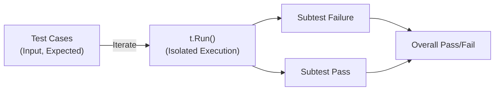

# 🛠️ Testing in Go

Go's built-in `testing` package provides a robust framework for unit tests, benchmarks, and examples with minimal ceremony.

---

## 1. Core Concepts

| Concept | Description / Purpose |
| :--- | :--- |
| **`testing.T`** | The test object, used to control execution and report failures. |
| **Table-Driven Tests** | The idiomatic Go pattern for testing multiple cases in one function. |
| **Subtests (`t.Run`)** | Isolated test cases within a single test function. |
| **Test Helpers** | Functions used across multiple tests, marked with `t.Helper()`. |

---

## 2. 🗺️ Visual Representation



---

## 3. 💻 Implementation Examples

```go
func TestAdd(t *testing.T) {
    // 1. Initialisation (Table definition)
    tests := []struct {
        name string
        a, b int
        want int
    }{
        {"positive", 1, 2, 3},
        {"zero", 0, 0, 0},
    }
    
    // 2. Execution (Iteration over table)
    for _, tt := range tests {
        t.Run(tt.name, func(t *testing.T) {
            // 3. Finalisation (Assertion)
            assert.Equal(t, tt.want, Add(tt.a, tt.b))
        })
    }
}
```

---

## 📋 4. Common Patterns & Use Cases

- **Table-Driven Testing**: Testing many scenarios (success, edge cases, error conditions) in a single function.
- **Race Detection**: Using `-race` to identify data races in concurrent code.
- **Test Coverage**: Identifying which parts of your codebase are missing test coverage.

---

## ⚠️ 5. Critical Pitfalls & Best Practices

> [!WARNING]
> Use `t.Helper()` in all reusable test helper functions. This ensures failure reports point to the *caller* of the helper, not the helper function itself.

1. **Clear Test Names**: Name your subtests clearly to make it easy to identify which case failed.
2. **Deterministic Tests**: Avoid tests that rely on external state or timing (unless specifically for benchmarking).
3. **Small Assertions**: One `t.Run()` should ideally test only one specific aspect of your code's behavior.

---

## 🏃 Running the Examples

Explore the unit tests for runnable patterns:
- `helpers/helpers_test.go`: Demonstrates the effect of `t.Helper()`.
- `table/numbers/numbers_test.go`: Shows a classic table-driven test structure.

```bash
# Run tests with verbose output
go test -v ./internal/basics/testing/...
```

---

## 📚 Further Reading

- [Official Go Documentation: testing](https://pkg.go.dev/testing)
- [Effective Go: Testing](https://go.dev/doc/effective_go#testing)
