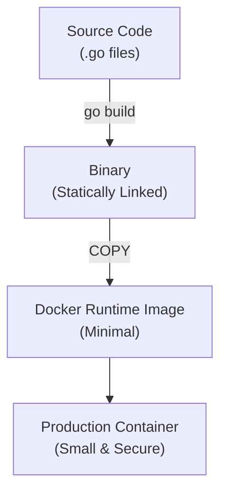

# 🛠️ Go Toolchain & Docker

Modern Go development revolves around its powerful, built-in toolchain and containerisation for production-grade deployments.

---

## 1. Core Concepts

| Tool / File | Description / Purpose |
| :--- | :--- |
| **`go mod`** | Go's dependency management system. Replaces the legacy `$GOPATH`. |
| **`go.mod`** | The manifest file for your module, defining its name and requirements. |
| **`go.sum`** | A lockfile containing checksums of specific module versions. |
| **`Dockerfile`** | A script for building container images. Multi-stage builds are the Go standard. |

---

## 2. 🗺️ Visual Representation



---

## 3. 💻 Implementation Examples

### Go Module Structure (`go.mod`)
```go
module my-cool-project

go 1.26.1

require (
    github.com/gin-gonic/gin v1.9.1
    github.com/stretchr/testify v1.8.4
)
```

### Essential CLI Commands
```bash
# Initialise a new module
go mod init my-cool-project

# Add missing dependencies & remove unused ones
go mod tidy

# Run your application directly
go run cmd/myapp/main.go

# Compile a binary for the current OS/Arch
go build -o myapp ./cmd/myapp

# Run tests in the current directory
go test ./...

# Install a tool to your $GOPATH/bin
go install github.com/swaggo/swag/cmd/swag@latest
```

### Multi-Stage Dockerfile
```dockerfile
# Stage 1: Builder
FROM golang:1.26-alpine AS builder
WORKDIR /app
COPY go.mod go.sum ./
RUN go mod download
COPY . .
RUN CGO_ENABLED=0 go build -trimpath -o /app/myapp ./cmd/myapp

# Stage 2: Final Runtime
FROM scratch
COPY --from=builder /app/myapp /myapp
ENTRYPOINT ["/myapp"]
```

---

## 4. 📋 Common Patterns & Use Cases

- **Caching Dependencies**: Copying `go.mod` and `go.sum` before the rest of the source in a Dockerfile to cache the `go mod download` layer.
- **Reproducible Builds**: Using `-trimpath` and pinned Go versions in Docker to ensure the same source always produces the same binary.
- **Minimal Images**: Using `scratch` or `alpine` for the final runtime image to reduce the attack surface and image size.

---

## 5. ⚠️ Critical Pitfalls & Best Practices

> [!WARNING]
> Never commit your vendor directory or local configuration files to source control. Rely on `go.mod` and environment variables.

1. **Keep go.mod Tidy**: Frequently run `go mod tidy` to prune unused dependencies.
2. **Checksum Integrity**: Never manually edit `go.sum`. It is managed automatically by the toolchain to ensure supply-chain security.
3. **Static Binaries**: Always set `CGO_ENABLED=0` when building for `scratch` or `distroless` images to avoid runtime failures due to missing C libraries.

---

## 🏃 Running the Examples

Explore how to interact with the Go toolchain:
- `toolchain.go`: A simple application to test building and running.

```bash
# Build the local example
go build -o toolchain-demo internal/basics/toolchain/toolchain.go

# Run the compiled binary
./toolchain-demo
```

## Your Next Step
Now that you can build and package your code, it's time to dive into the core language primitives.
Explore **[Basic Types](../types/README.md)** to learn about variables, slices, and maps.

---

## 📚 Further Reading

- [Go Modules Reference](https://go.dev/ref/mod)
- [Dockerizing a Go Application](https://docs.docker.com/language/golang/build-images/)
- [Shrinking your Go binaries](https://blog.filippo.io/shrink-your-go-binaries-with-this-one-weird-trick/)
