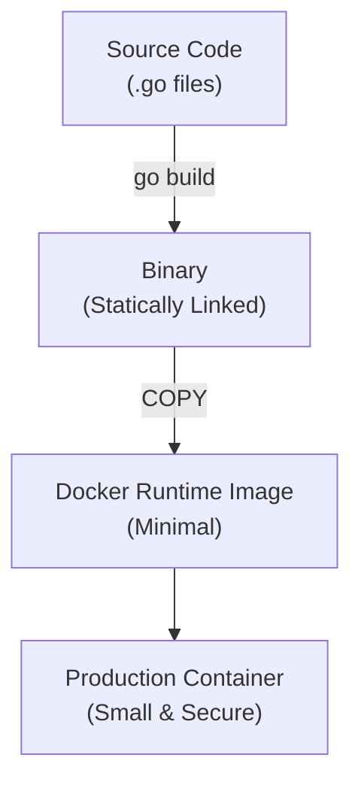

# 🛠️ Go Toolchain & Docker

Modern Go development revolves around its powerful, built-in toolchain and containerisation for production-grade deployments.

---

## 1. Core Concepts

| Tool / File | Description / Purpose |
| :--- | :--- |
| **Go Modules** | Go's dependency management system. Replaces the legacy GOPATH workspace. |
| **`go.mod`** | The manifest file for your module, defining its name and requirements. |
| **`go.sum`** | A lockfile containing checksums of specific module versions. |
| **`Dockerfile`** | A script for building container images. Multi-stage builds are the Go standard. |

---

## 2. 🗺️ Visual Representation



---

## 3. 💻 Implementation Examples

### Essential CLI Commands

Initialise a new module:
```bash
go mod init my-cool-project # Run this when starting a new project
```

Add missing dependencies and remove unused ones:
```bash
go mod tidy
```

Run your application directly:
```bash
go run internal/basics/toolchain/toolchain.go
```

Compile a binary for the current OS/Arch:
```bash
go build -o toolchain-demo ./internal/basics/toolchain
```

Run tests in the current directory:
```bash
go test -v ./internal/basics/toolchain/...
```

Install a tool to your `$GOPATH/bin`:
```bash
go install github.com/swaggo/swag/cmd/swag@latest
```

### Multi-Stage Dockerfile
```dockerfile
# Stage 1: Builder
FROM golang:1.26-alpine AS builder
WORKDIR /app
COPY go.mod go.sum ./
RUN go mod download
COPY . .
RUN CGO_ENABLED=0 go build -trimpath -o /app/myapp ./internal/basics/toolchain

# Stage 2: Final Runtime
FROM scratch
COPY --from=builder /app/myapp /myapp
ENTRYPOINT ["/myapp"]
```

---

## 4. 📋 Common Patterns & Use Cases

- **Caching Dependencies**: Copying `go.mod` and `go.sum` before the rest of the source in a Dockerfile to cache the `go mod download` layer.
- **Reproducible Builds**: Using `-trimpath` and pinned Go versions in Docker to ensure the same source always produces the same binary.
- **Minimal Images**: Using `scratch` or `alpine` for the final runtime image to reduce the attack surface and image size.

---

## 5. ⚠️ Critical Pitfalls & Best Practices

> [!WARNING]
> Never commit your vendor directory or local configuration files to source control. Rely on `go.mod` and environment variables.

1. **Keep go.mod Tidy**: Frequently run `go mod tidy` to prune unused dependencies.
2. **Checksum Integrity**: Never manually edit `go.sum`. It is managed automatically by the toolchain to ensure supply-chain security.
3. **Static Binaries**: Always set `CGO_ENABLED=0` when building for `scratch` or `distroless` images to avoid runtime failures due to missing C libraries.

---

## 🏃 Running the Examples

Explore how to interact with the Go toolchain using the local demo file:

1. Build the local example:
```bash
go build -o toolchain-demo ./internal/basics/toolchain
```

2. Run the compiled binary:
```bash
./toolchain-demo
```

3. Run the tests:
```bash
go test -v ./internal/basics/toolchain/...
```

## Your Next Step
Now that you can build and package your code, it's time to dive into the core language primitives.
Explore **[Basic Types](../types/README.md)** to learn about variables, slices, and maps.

---

## 📚 Further Reading

- [Go Modules Reference](https://go.dev/ref/mod)
- [Dockerizing a Go Application](https://docs.docker.com/language/golang/build-images/)
- [Shrinking your Go binaries](https://blog.filippo.io/shrink-your-go-binaries-with-this-one-weird-trick/)
