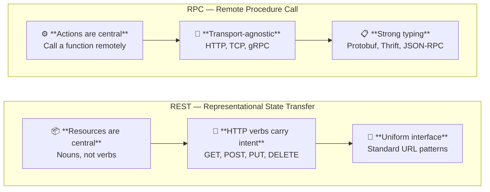
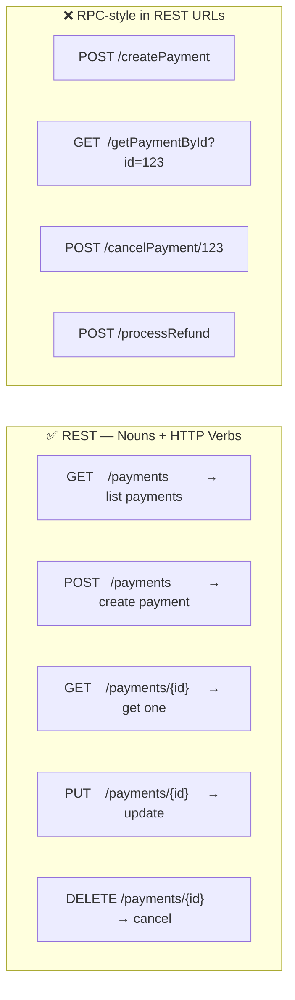
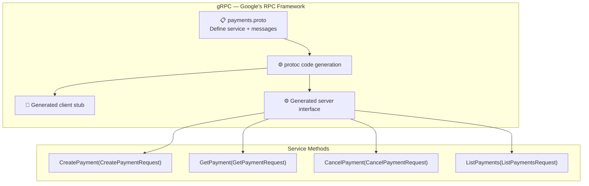
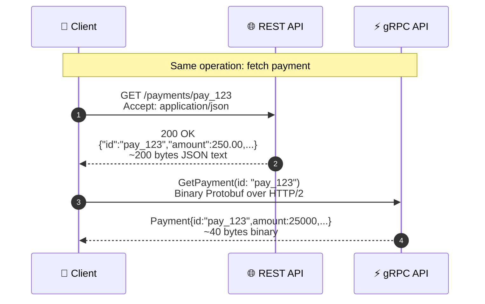
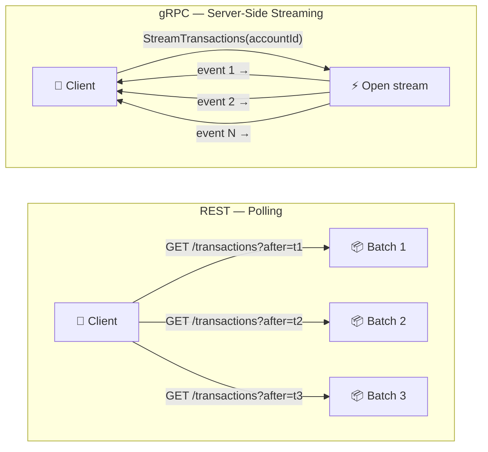
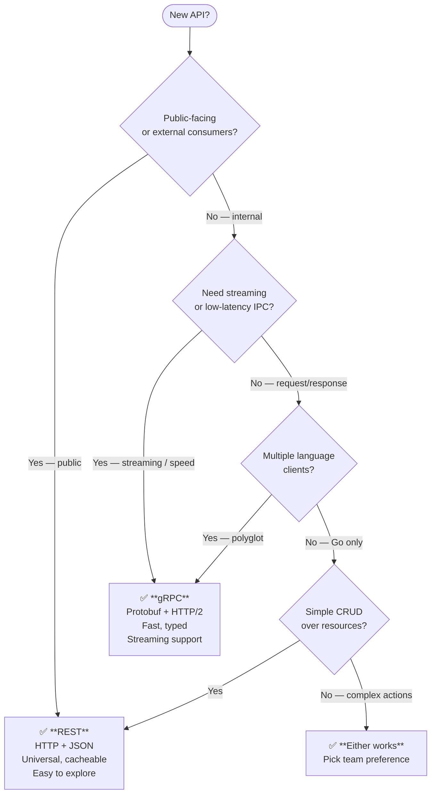
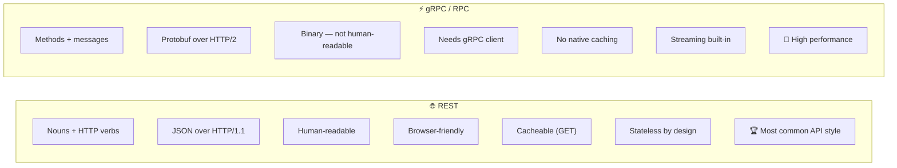

# REST vs RPC

---

## Two Philosophies of API Design

> REST models the **world as resources**. RPC models it as **function calls**.

---

## REST: Resource-Oriented Design

> The URL identifies the resource. The HTTP method identifies the operation.

---

## RPC: Action-Oriented Design

> gRPC: strongly typed, binary protocol, HTTP/2, bidirectional streaming — fast and efficient.

---

## REST vs gRPC: Wire Format Comparison

> gRPC payloads are typically **5–10× smaller** than equivalent JSON. Critical for high-throughput systems.

---

## Streaming: Where RPC Wins

> gRPC streaming keeps a single connection open. No polling, no overhead. Ideal for real-time feeds.

---

## When to Use REST vs RPC

---

## Side-by-Side Summary

> Possibility of both: public APIs use REST. Internal microservice-to-microservice calls may use gRPC for throughput.
