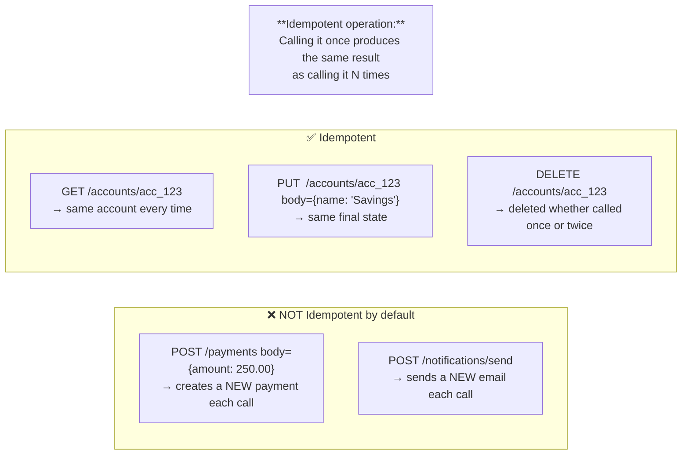
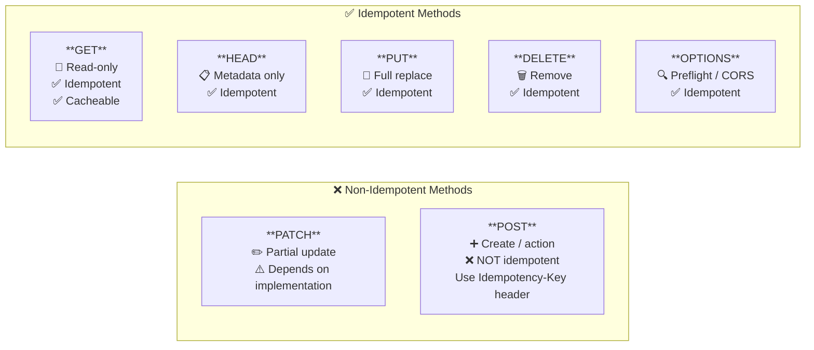
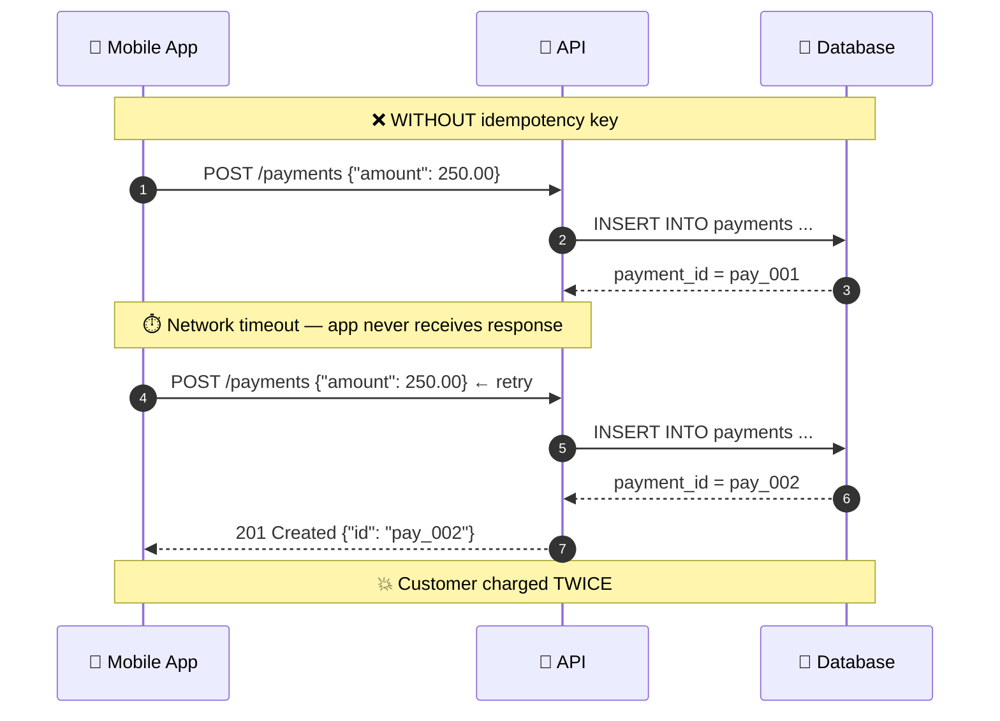
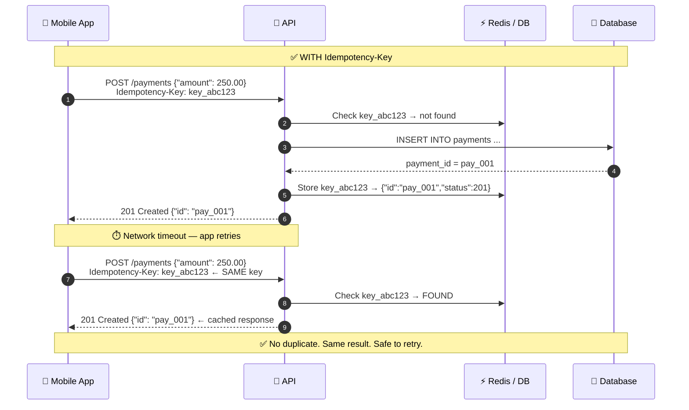
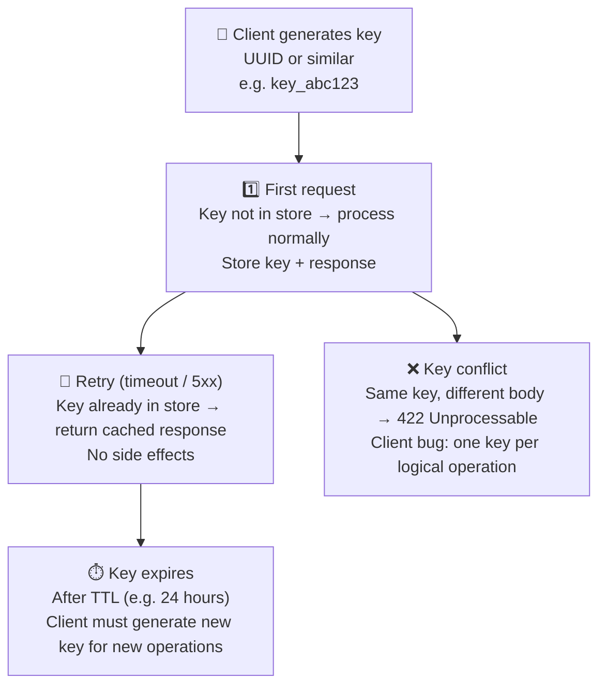
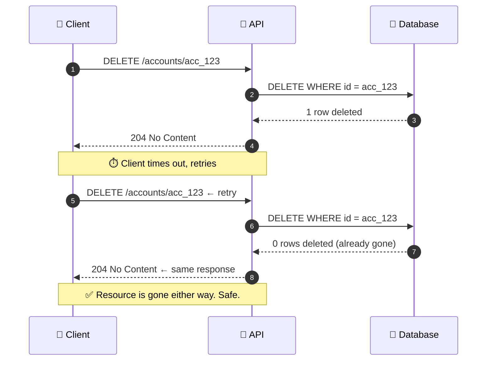
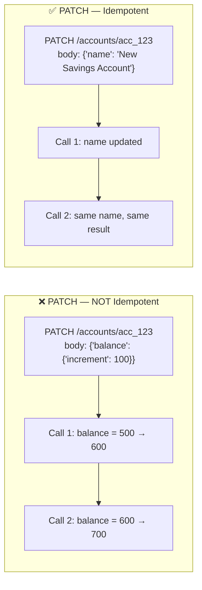
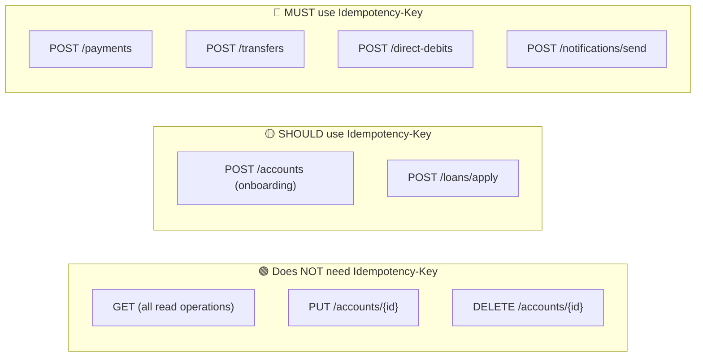

# Idempotency

---

## What Is Idempotency?

> If a retry is safe and produces no extra side effects, the operation is idempotent.

---

## HTTP Methods and Idempotency

---

## The Double-Charge Problem

---

## The Fix: Idempotency-Key Header

> The key must be generated **client-side** before the request is sent, and reused on every retry of the same logical operation.

---

## Idempotency Key Lifecycle

---

## DELETE Idempotency: Already Gone Is Fine

> Return `204` (not `404`) on a repeat DELETE. The desired state — "this resource must not exist" — has been achieved.

---

## PATCH: Conditional Idempotency

> A PATCH that **sets an absolute value** is idempotent. A PATCH that **increments** is not — use an Idempotency-Key.

---

## Idempotency at Financial Institutions: What Gets a Key

> Every operation with a **financial side effect** must be idempotent. Retries happen. Networks fail. Design for it.
