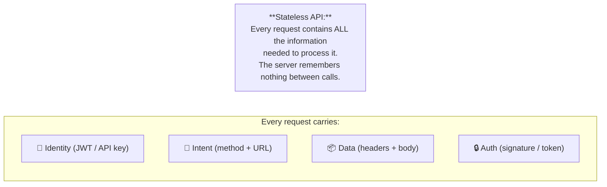
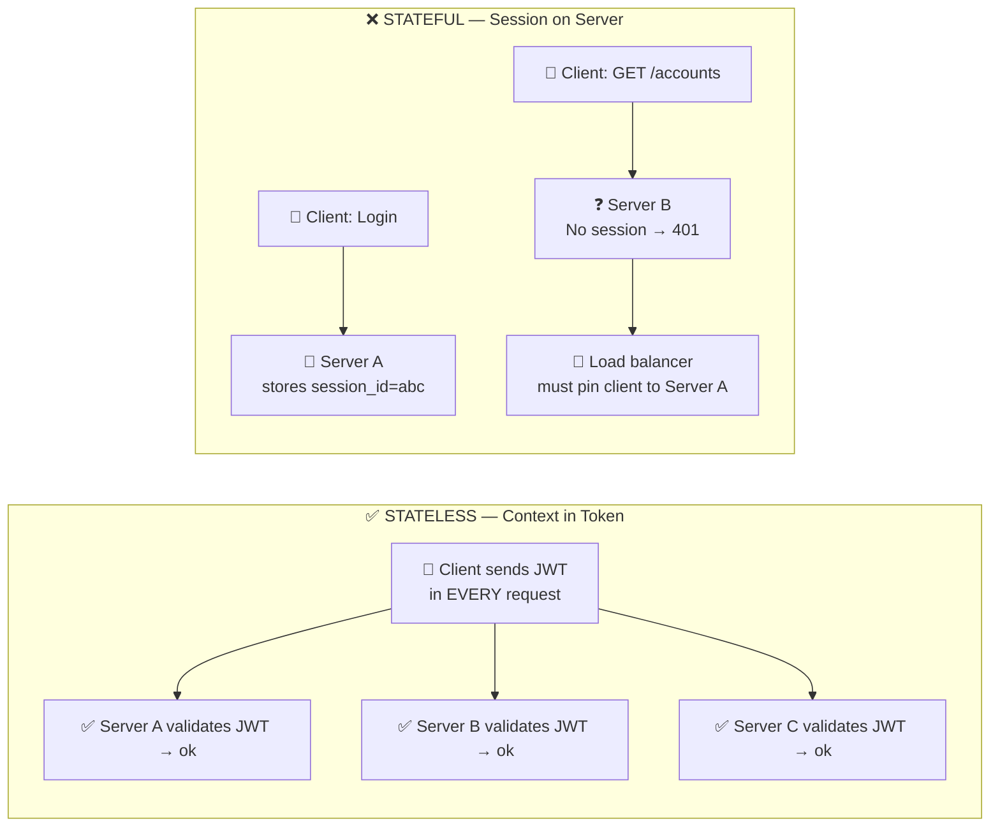
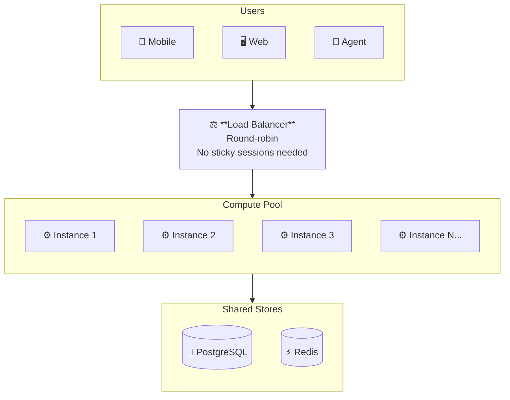
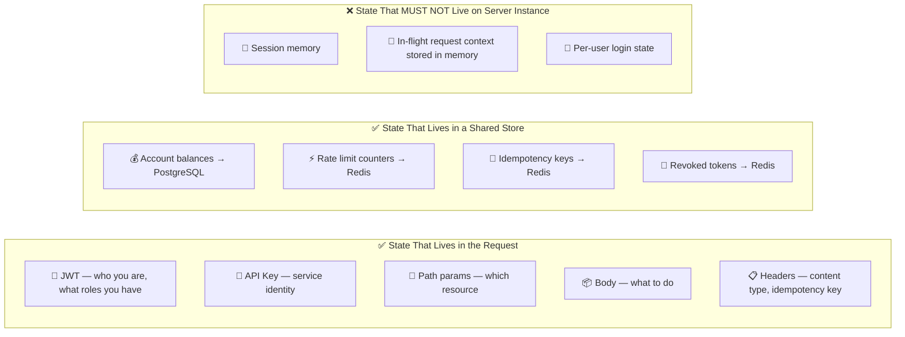
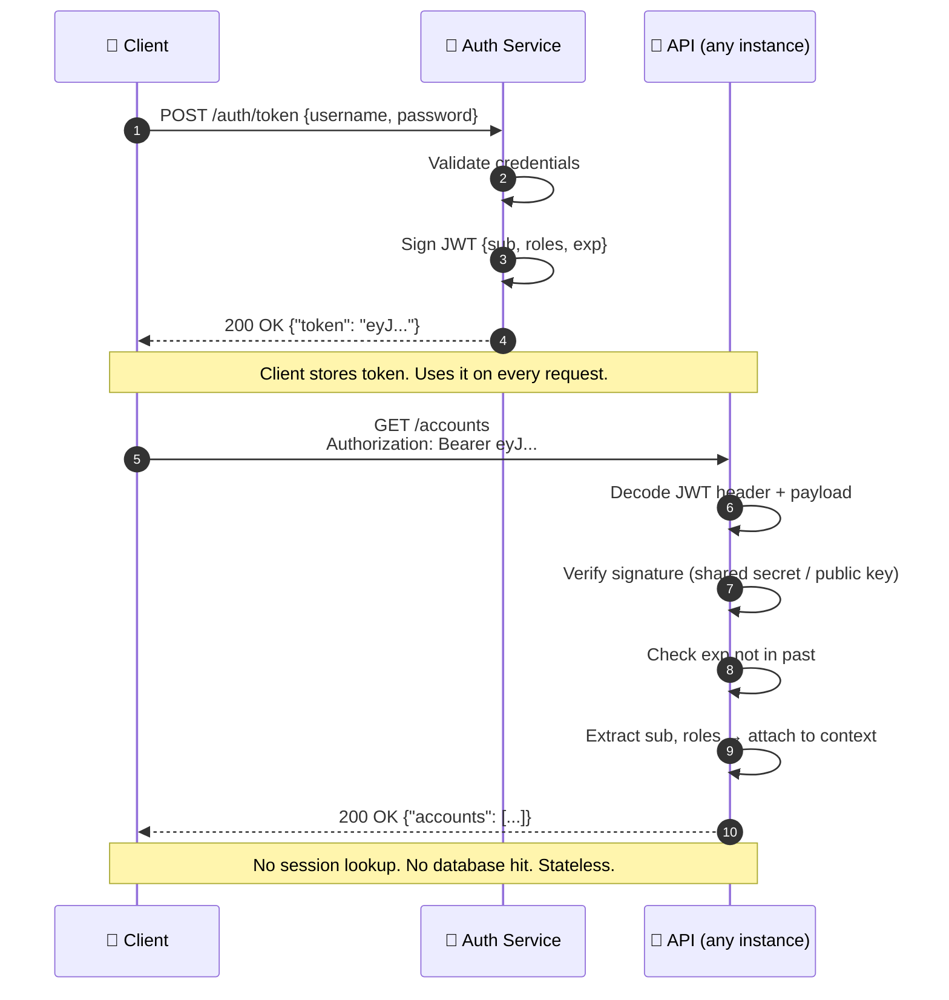
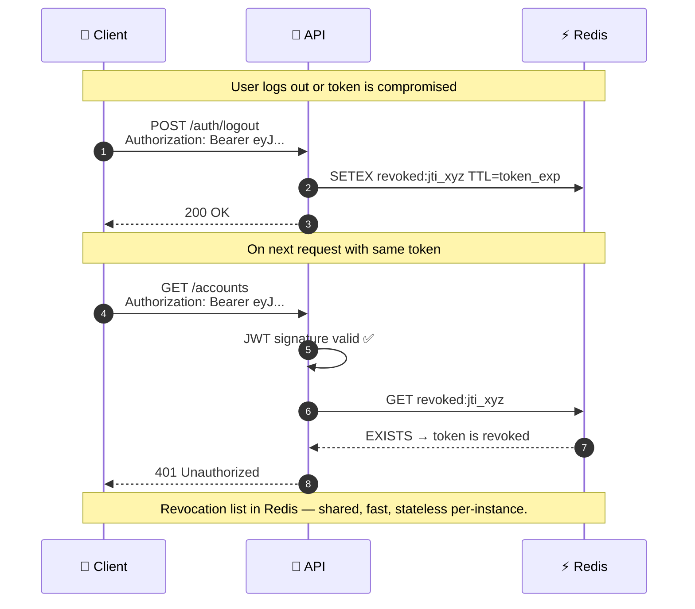
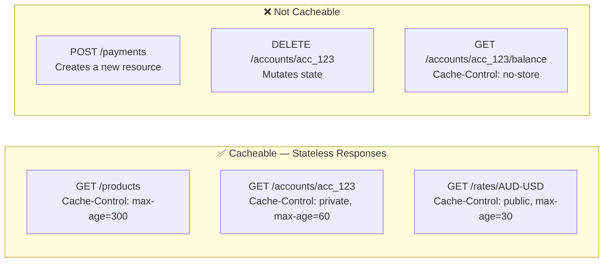
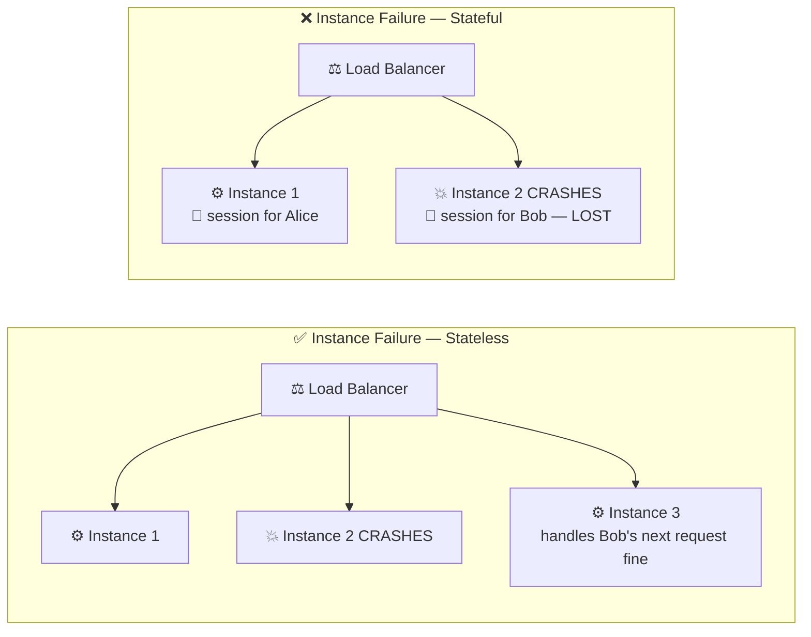

# Statelessness

---

## What Is Statelessness?

> The server has no memory of you. Each request stands alone.

---

## Stateful vs Stateless

> Stateless = any server instance can handle any request. No pinning, no shared memory.

---

## Scaling: The Stateless Advantage

> Add an instance → more capacity, instantly. Remove an instance → no sessions lost.

---

## What Goes Where

---

## JWT: The Stateless Identity Token

---

## Token Revocation: Handling the Stateless Edge Case

> The server is still stateless per-instance. Revocation state lives in the **shared store**, not in server memory.

---

## Cache-Control: Stateless Caching

> Stateless responses can be cached by CDNs and proxies. Mutable-state responses must opt out explicitly.

---

## Statelessness and Fault Tolerance

> When a stateless instance crashes, the load balancer routes to another. **No user session is lost.**
