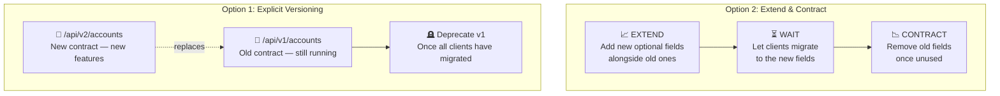
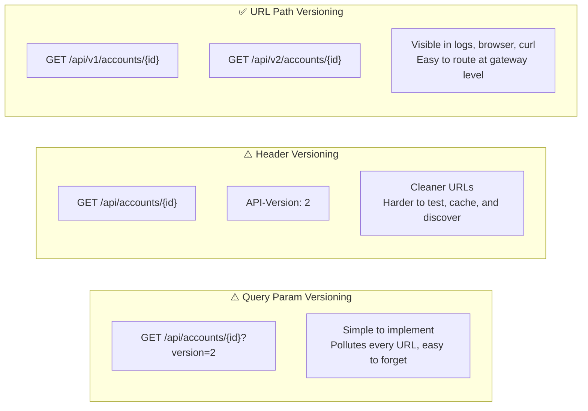
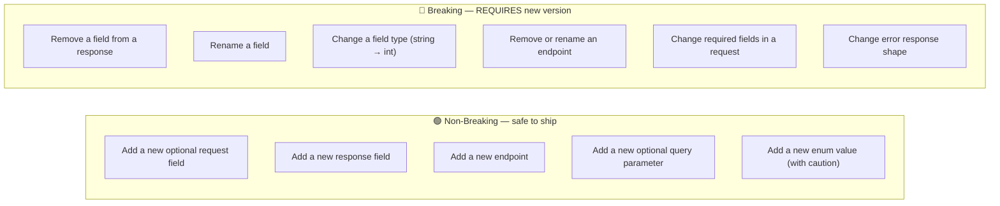
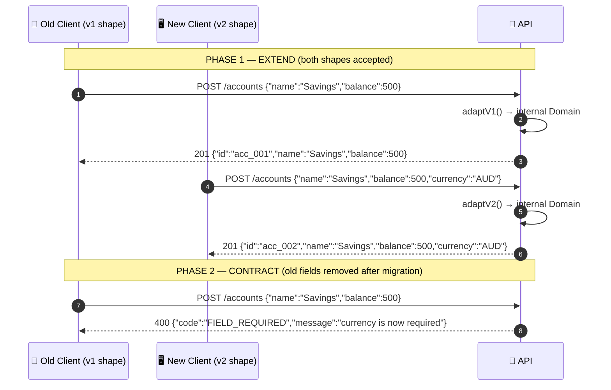
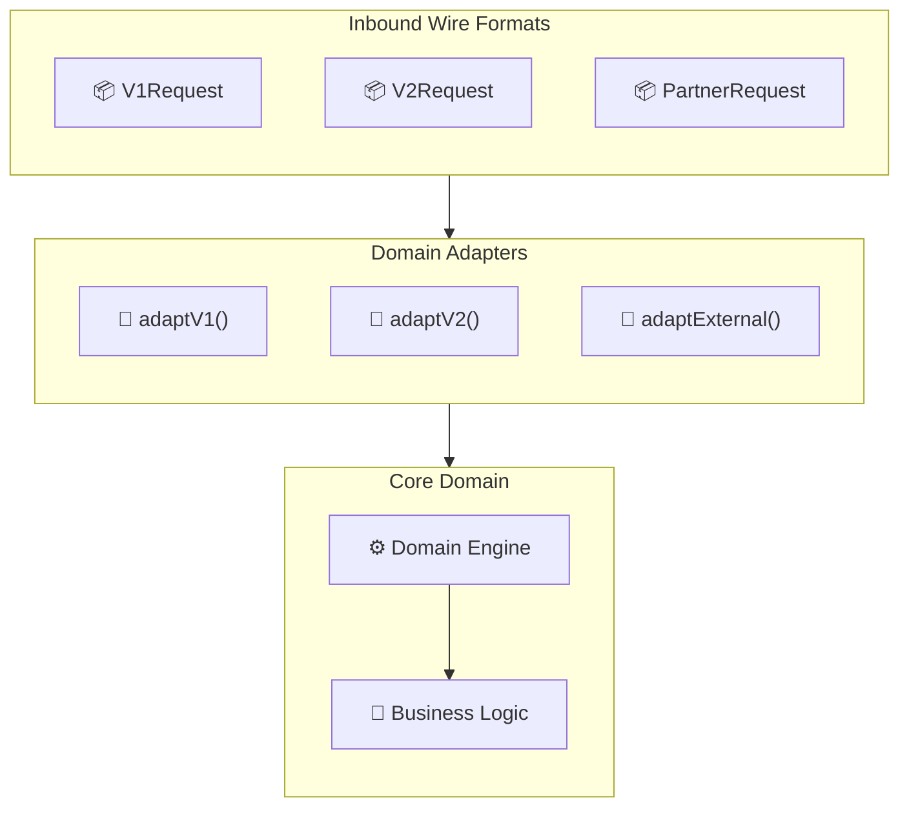
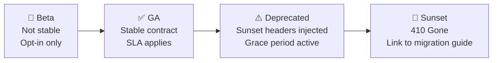

# API Versioning

---

## Two Strategies for Managing Breaking Changes

> Versioning gives clients explicit contracts. Extend & Contract avoids version sprawl by evolving in place.

---

## URL Versioning: Where the Version Lives

> URL path versioning is the most explicit and widely adopted. Clients know exactly which contract they are using.

---

## What Constitutes a Breaking Change?

> When in doubt: if a client compiled against the old spec will break on the new response — it is a breaking change.

---

## Extend & Contract: The Two Phases in Action

---

## Adapter Pattern: Many Wire Shapes, One Domain

> Every API shape is an adapter. The domain model stays clean. Business logic never knows about wire formats.

---

## Version Lifecycle: From GA to Removal

> Every version has a lifecycle. Communicate it early, enforce it consistently.
