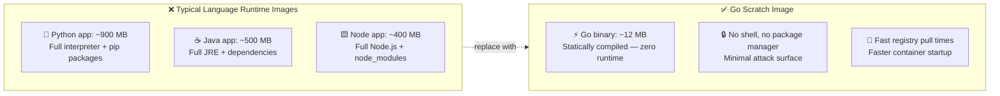
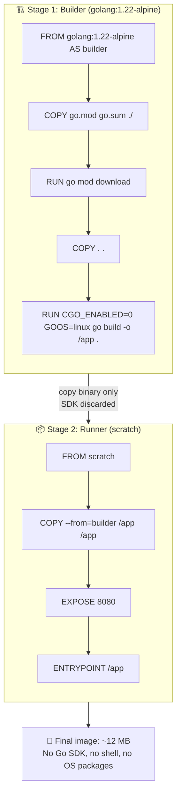
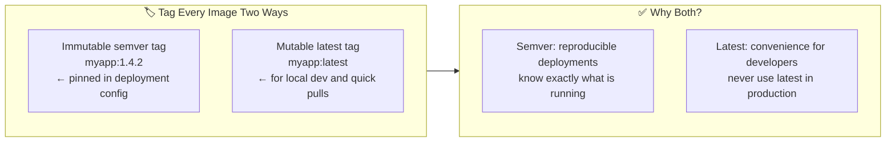
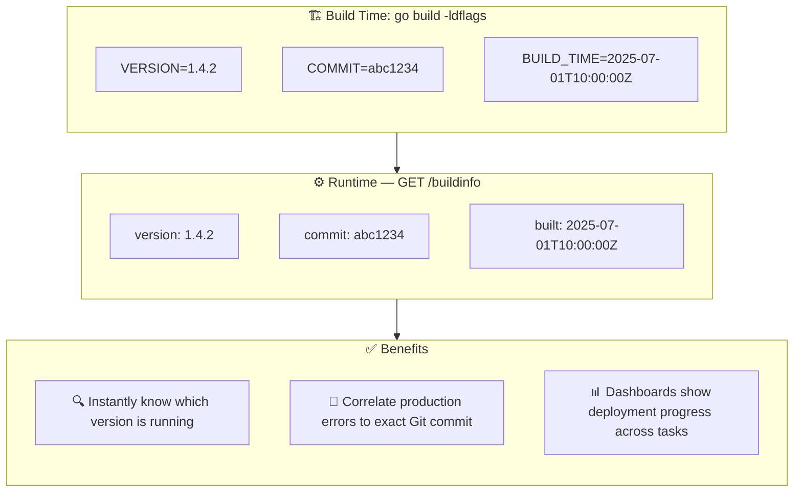
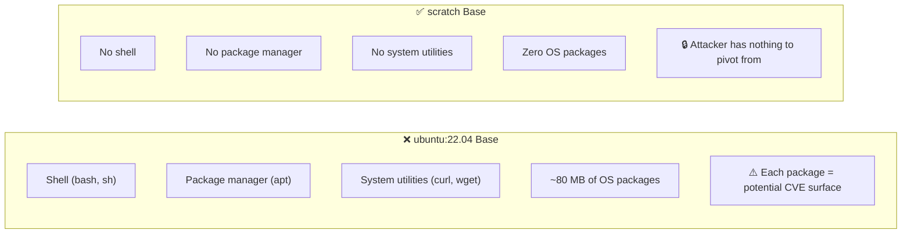
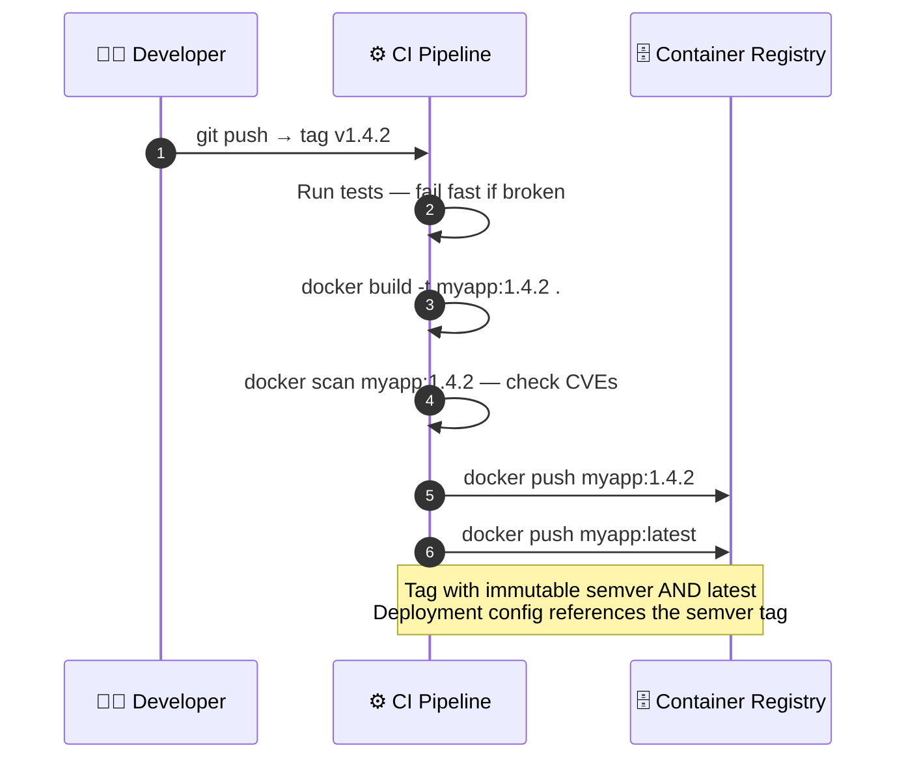

# Containerisation

---

## Why Tiny, Static Binaries Matter

> A static Go binary needs no runtime. The container image is just the binary — nothing else.

---

## Multi-Stage Docker Build

> The builder stage has the full Go SDK. The runner stage has only the compiled binary. The SDK is thrown away.

---

## Image Tagging Strategy

> Production deployments must reference immutable tags. `latest` is a moving target — unsafe for rollbacks.

---

## Build-Time Version Metadata

> Embed version metadata at build time. Expose it via `/buildinfo`. Never guess what is running in production.

---

## Container Security: The Scratch Advantage

> With a scratch image, a compromised container has no tools to escalate with. The attack surface is the application code itself — nothing more.

---

## CI/CD Image Build Pipeline

