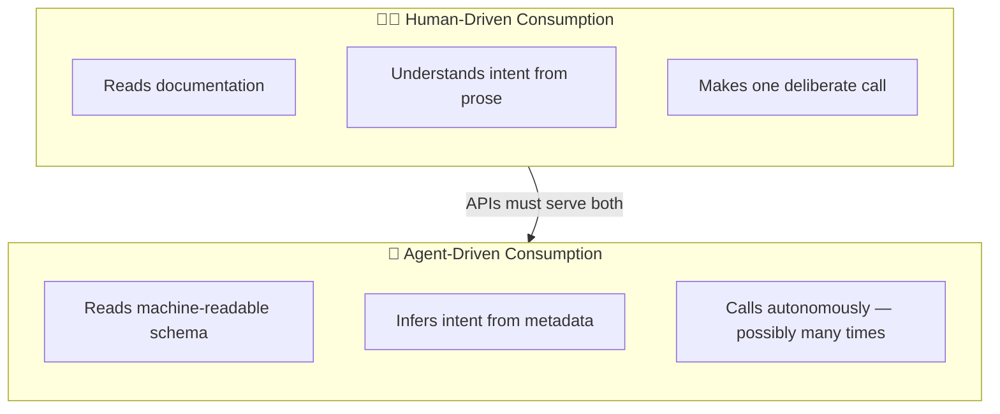
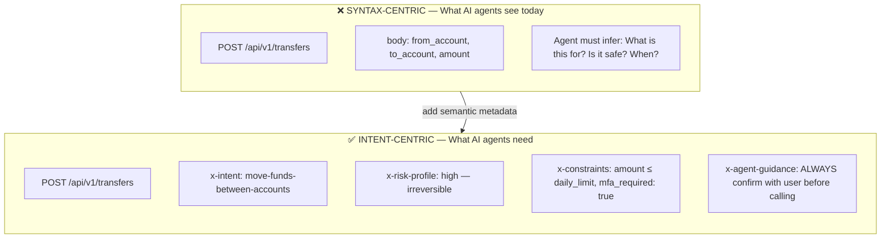
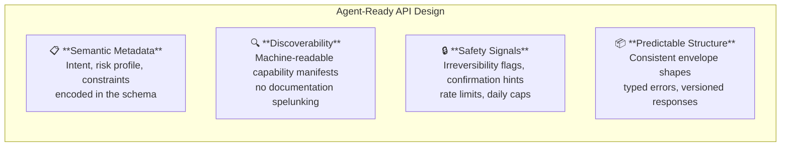
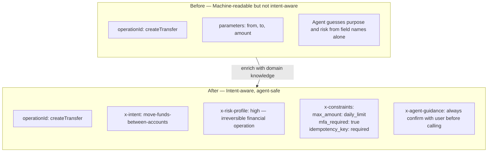
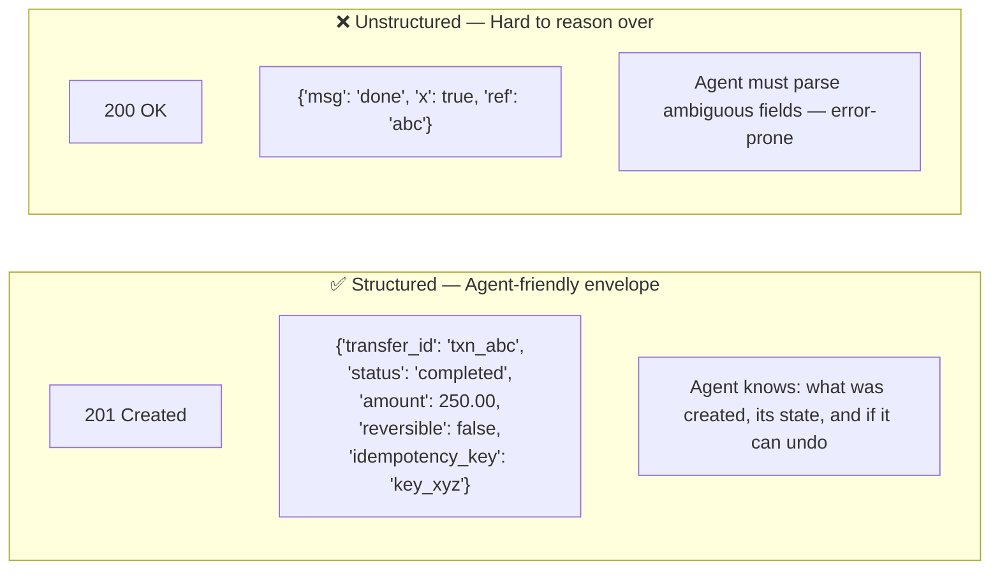
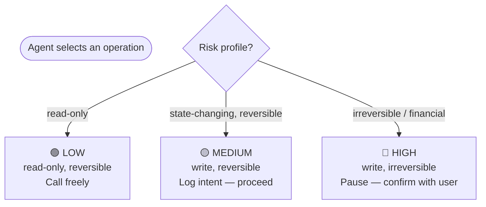
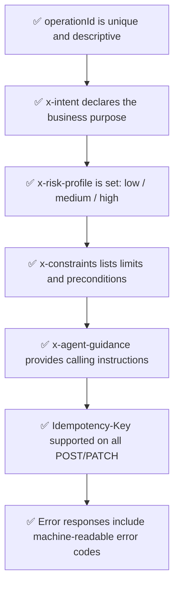

# Designing APIs for AI Consumption

---

## Human-Driven vs Agent-Driven API Consumption

> An API designed only for humans will fail agents. Agents cannot read prose documentation — they need **structured metadata** that encodes intent, risk, and constraints directly in the schema.

---

## Syntax-Centric vs Intent-Centric Design

> APIs must shift from documenting **what** they accept to declaring **why** they exist, **when** they are safe to call, and **what constraints** govern them.

---

## The Four Pillars of Agent-Ready API Design

---

## Semantic Metadata on OpenAPI Specs

> The AI does not need to guess. The metadata **is** the contract.

---

## Structuring Responses Agents Can Reason Over

---

## Risk Tiering: How Agents Should Treat Operations

---

## Agent-Safe API Checklist

