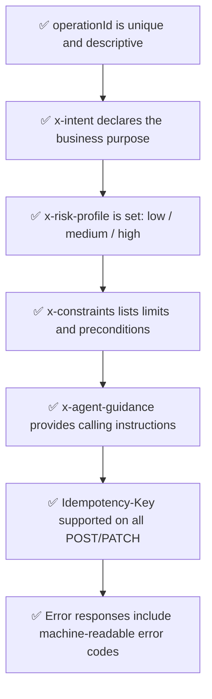

# Designing APIs for AI Consumption

---

## Why Standard REST Isn't Enough for Agents

While humans can "read between the lines" of an API, autonomous agents require explicit metadata to safely discover, understand, and invoke capabilities.

---

## The AI-First API Checklist

```mermaid
graph TD
    C1["✅ operationId is unique and descriptive"]
    C2["✅ x-intent declares the business purpose"]
    C3["✅ x-risk-profile is set: low / medium / high"]
    C4["✅ x-constraints lists limits and preconditions"]
    C5["✅ x-agent-guidance provides calling instructions"]
    C6["✅ Idempotency-Key supported on all POST/PATCH"]
    C7["✅ Error responses include machine-readable error codes"]

    C1 --> C2 --> C3 --> C4 --> C5 --> C6 --> C7
```

## Your Next Step

Designing APIs for AI is only half the battle. How do we standardize the communication between these models and our tools?

Discover the standard for AI-tool interaction in: **[Model Context Protocol (MCP)](02-model-context-protocol.md)**.
