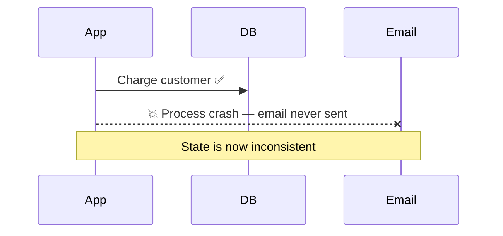
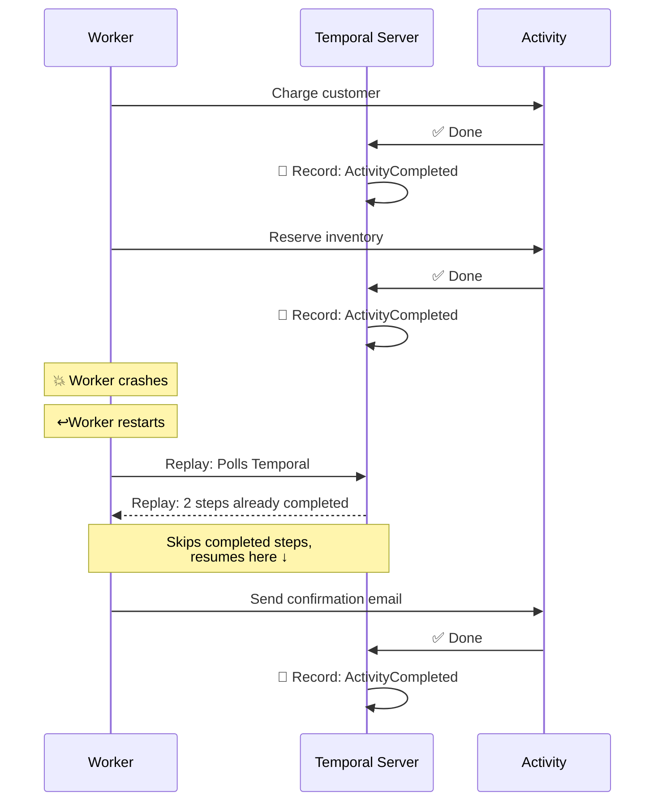
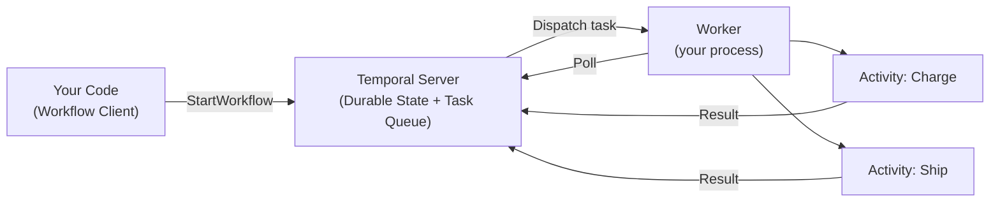

# ⏱️ Temporal: Durable Workflow Orchestration

Raw goroutines and channels are powerful for short-lived concurrent work, but they break down when tasks need to survive **process crashes**, **network failures**, and **restarts**. Temporal provides **durable execution**: your code runs to completion even if the machine dies halfway through.

---

## Order Processing Demo (Order Saga)

The demo features an **Order Processing Saga** demonstrating durable execution, signal handling, and child workflows. While the core banking service uses standard database transactions, this module explores how to orchestrate complex, multi-step business processes that require reliable state management across many services.

## 1. The Problem Temporal Solves

Imagine a multi-step order flow: charge the customer → reserve inventory → send a confirmation email. Without Temporal, a crash between any two steps leaves inconsistent state and no automatic recovery.

With Temporal, the Workflow is **durable**: it resumes exactly where it left off.

---

## 2. Core Concepts

| Concept | What it is | Analogy |
|---|---|---|
| **Workflow** | Deterministic, replayable orchestration logic. Never does I/O directly. | The recipe |
| **Activity** | A single retriable step: an API call, DB write, email send. | One step in the recipe |
| **Worker** | A process that polls Temporal and executes Workflows and Activities. | The chef |
| **Task Queue** | A named queue Workers listen on; routes work to the right Workers. | The order ticket rail |
| **Signal** | An external event sent into a running Workflow to influence its state. | A customer calling to change their order |

---

## 3. How It Fits Together

The **Temporal Server** is just a durable queue and state store — it holds no business logic. All your business logic lives in your Worker process.

---

## 4. The Golden Rule: Workflows Must Be Deterministic

Temporal reconstructs a Workflow's state by **replaying its event history** after a crash. This means Workflow code must always make the same decisions given the same history.
For most non-deterministic functions used typically, Temporal's SDK offers deterministic alternatives. e.g.,

| ❌ Instead of this | ✅ Do this instead |
|---|---|
| `time.Now()` | `workflow.Now(ctx)` |
| `rand.Int()` | `workflow.SideEffect(...)` |
| `http.Get(url)` | Call an Activity |
| `os.Getenv(...)` | Pass as Workflow input |
| `go func() { ... }` | `workflow.Go(ctx, ...)` |

Breaking this rule causes **non-determinism errors** — Temporal detects that the replayed decisions don't match history and panics the Workflow.

Any complex non-deterministic code (e.g., network calls, I/O, database operations) should sit in an activity.

> [!TIP]
> Temporal will not re-execute activities when replaying workflows. 
> However, if an activity does not return or produce an error (i.e., the worker crashes or some other error prevents the activity from being recorded in Temporal's event history),
> the activity may be re-executed. Because of this, Temporal recommends activities be ***idempotent***.
>
> This means that, executing the same activity with the same set of inputs multiple times should be the same as executing the activity once.
> Be mindful when designing activities that they can be safely executed multiple times without causing unexpected side-effects.

---

## 5. What's in This Module

| Directory | Contents |
|---|---|
| `order/` | Order domain model and status transitions |
| `workflows/` | Workflow definitions (automated + signal-driven) |
| `activities/` | Individual retriable steps (inventory, shipping) |
| `integrations/` | External service clients (WireMock inventory API) |
| `encryption/` | Data converter for payload encryption |

Ready to run it? See the **[Order Processing Demo →](order/README.md)**

---

## 📚 Further Reading

- [Temporal Go SDK documentation](https://docs.temporal.io/develop/go)
- [Temporal tutorials](https://learn.temporal.io/)
- [Saga pattern explained](https://microservices.io/patterns/data/saga.html)
