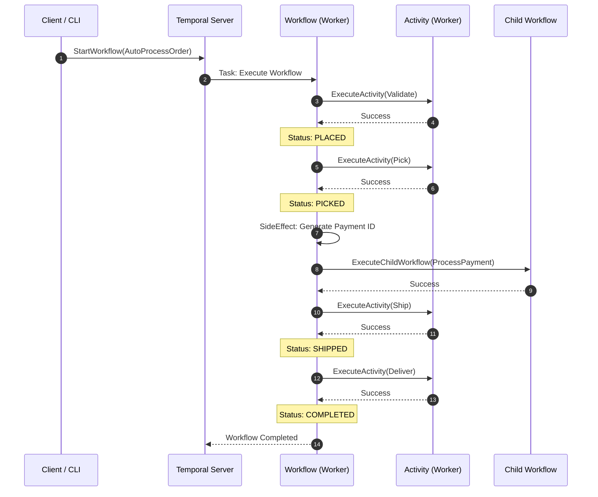
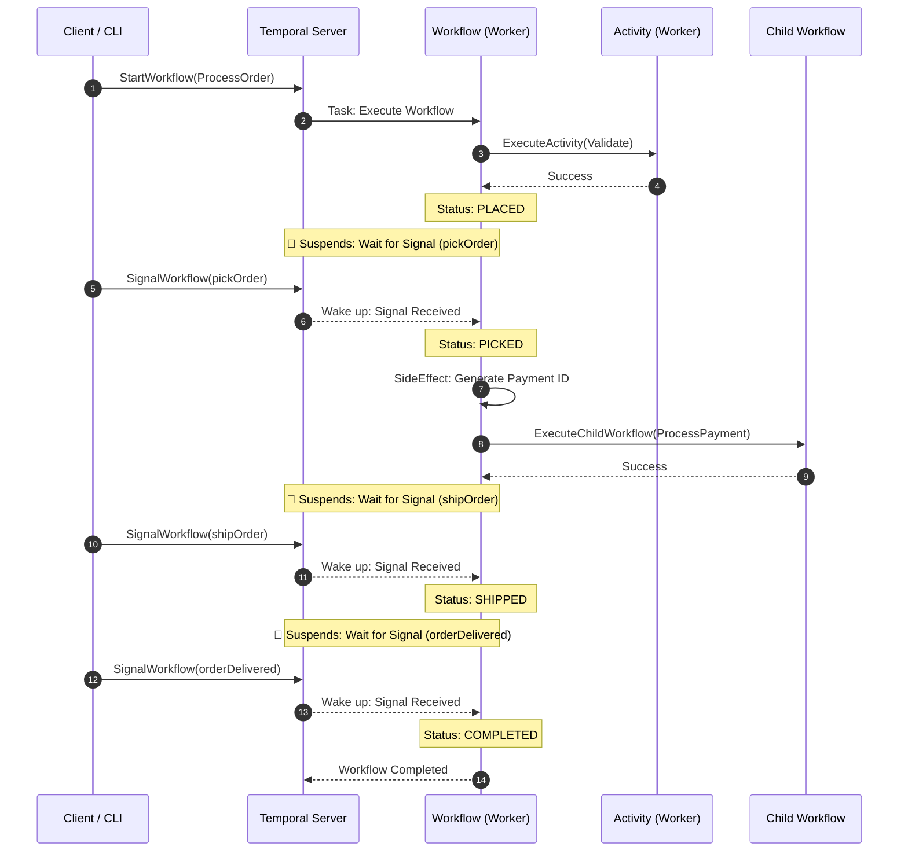

# ⏱️ Order Processing Implementation

This module contains the implementation of a durable **Order Processing Workflow** using Temporal. It demonstrates how to orchestrate complex, multi-step business processes with reliable state management, signal handling, and child workflows.

For a general overview of Temporal concepts, see **[TEMPORAL.md](TEMPORAL.md)**.

---

## 🏗️ Workflow Lifecycle Diagrams

### 1. Automated Workflow (`AutoProcessOrder`)
This workflow demonstrates **Durable Automation**. It drives the entire lifecycle through completion by executing a series of Activities without requiring external intervention.


```mermaid
sequenceDiagram
    autonumber
    participant C as Client / CLI
    participant T as Temporal Server
    participant W as Workflow (Worker)
    participant A as Activity (Worker)
    participant CW as Child Workflow

    C->>T: StartWorkflow(AutoProcessOrder)
    T->>W: Task: Execute Workflow
    
    W->>A: ExecuteActivity(Validate)
    A-->>W: Success
    Note over W: Status: PLACED

    W->>A: ExecuteActivity(Pick)
    A-->>W: Success
    Note over W: Status: PICKED

    W->>W: SideEffect: Generate Payment ID
    W->>CW: ExecuteChildWorkflow(ProcessPayment)
    CW-->>W: Success

    W->>A: ExecuteActivity(Ship)
    A-->>W: Success
    Note over W: Status: SHIPPED

    W->>A: ExecuteActivity(Deliver)
    A-->>W: Success
    Note over W: Status: COMPLETED
    W-->>T: Workflow Completed
```

### 2. Signal-Driven Workflow (`ProcessOrder`)
This workflow demonstrates **External Interactivity**. It pauses at key stages and waits for external signals (from a user or another system) to proceed.


```mermaid
sequenceDiagram
    autonumber
    participant C as Client / CLI
    participant T as Temporal Server
    participant W as Workflow (Worker)
    participant A as Activity (Worker)
    participant CW as Child Workflow

    C->>T: StartWorkflow(ProcessOrder)
    T->>W: Task: Execute Workflow
    
    W->>A: ExecuteActivity(Validate)
    A-->>W: Success
    Note over W: Status: PLACED

    Note over W,T: 🛑 Suspends: Wait for Signal (pickOrder)
    C->>T: SignalWorkflow(pickOrder)
    T-->>W: Wake up: Signal Received
    Note over W: Status: PICKED

    W->>W: SideEffect: Generate Payment ID
    W->>CW: ExecuteChildWorkflow(ProcessPayment)
    CW-->>W: Success

    Note over W,T: 🛑 Suspends: Wait for Signal (shipOrder)
    C->>T: SignalWorkflow(shipOrder)
    T-->>W: Wake up: Signal Received
    Note over W: Status: SHIPPED

    Note over W,T: 🛑 Suspends: Wait for Signal (orderDelivered)
    C->>T: SignalWorkflow(orderDelivered)
    T-->>W: Wake up: Signal Received
    Note over W: Status: COMPLETED
    W-->>T: Workflow Completed
```

---

## Workflows

### 1. `AutoProcessOrder` (Automated)
A version that drives the order through each stage automatically via Activities.
**Lifecycle**: PLACED → PICKED → SHIPPED → COMPLETED

### 2. `ProcessOrder` (Signal-Driven)
Represents a long-running order lifecycle that waits for external human or system signals to progress.
- **Status Tracking**: Uses a query handler `GetOrderStatus` to expose current state.
- **Determinism**: Uses `workflow.SideEffect` for stable UUID generation.
- **Child Workflow**: Executes `ProcessPayment` to handle financial transactions independently.

---

## Activities

| Activity | Description |
|---|---|
| `Validate` | Checks order ID and inventory. |
| `Pick` | Simulates warehouse picking. |
| `Ship` | Simulates creating a shipment. |
| `Deliver` | Simulates delivery confirmation. |

---

## Running the Demo

For the best experience, use **2 terminals**:

| Terminal | Purpose |
|---|---|
| **Terminal 1** | Runs the Temporal server + Worker process |
| **Terminal 2** | Sends commands — starts workflows, sends signals |

### Step 1: Start Services & Worker (Terminal 1)
```bash
make temporal-up
make worker-start
```

### Step 2: Run the Workflows (Terminal 2)

#### Automated Workflow (Simple):
```bash
make workflow-auto
```

#### Signal-Driven Workflow (Interactive):
1. **Start the workflow**:
   ```bash
   export ID=my-order-1
   make workflow-signal
   ```
2. **Drive the workflow**:
   ```bash
   make workflow-pick     # PLACED → PICKED
   make workflow-ship     # PICKED → SHIPPED
   make workflow-deliver  # SHIPPED → COMPLETED
   ```

---
[← Back to Main README](../../README.md)
