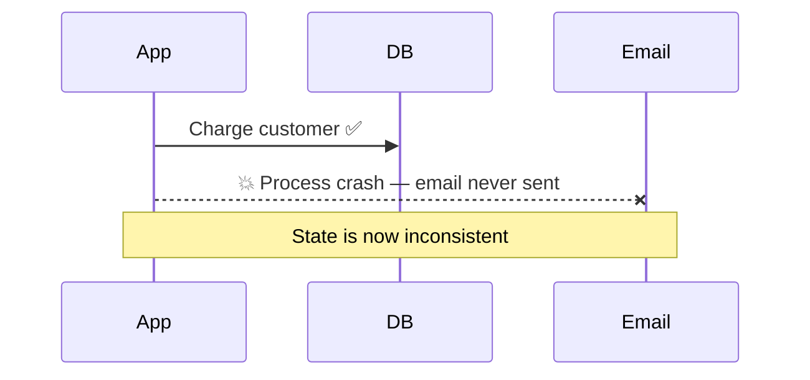
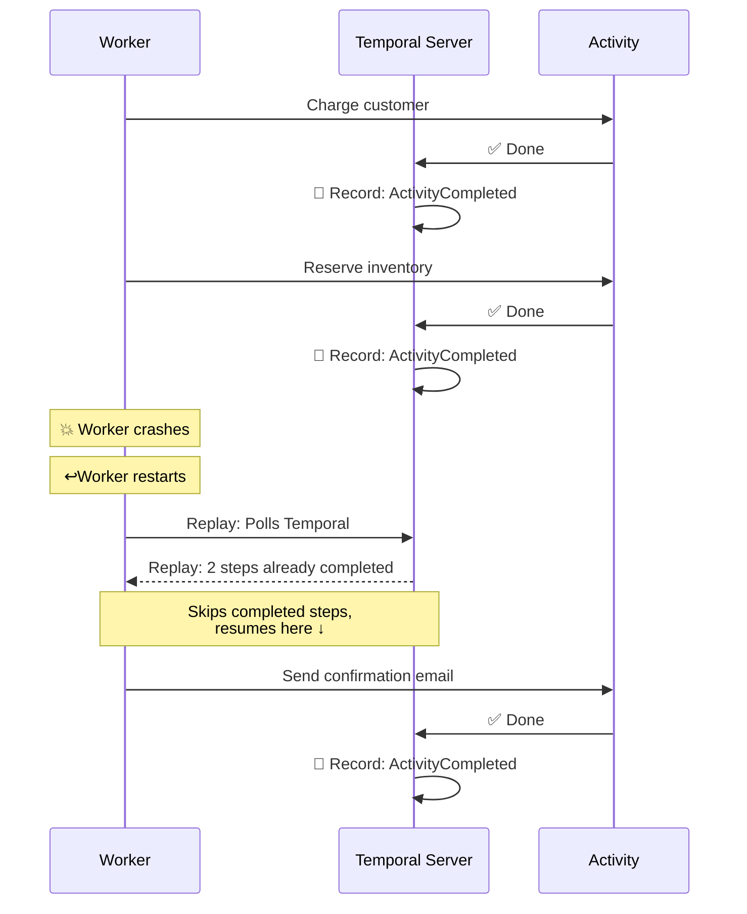
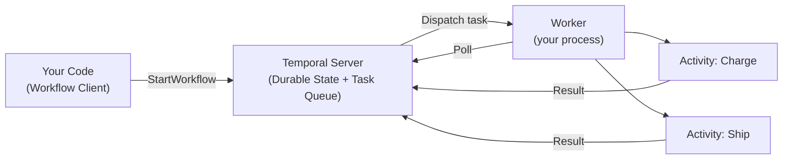
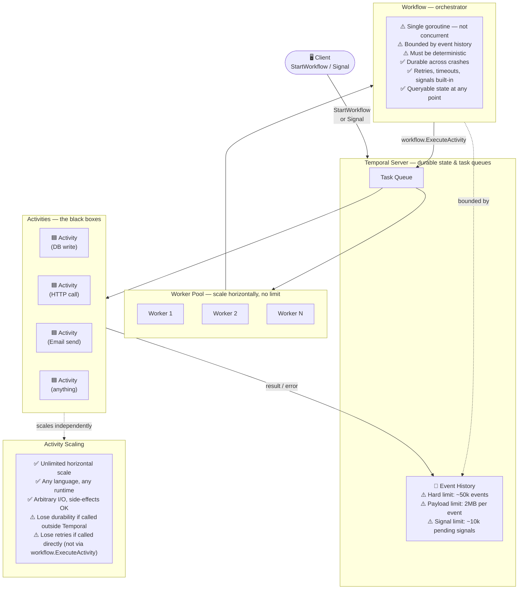

# ⏱️ Temporal: Durable Workflow Orchestration

Raw goroutines and channels are powerful for short-lived concurrent work, but they break down when tasks need to survive **process crashes**, **network failures**, and **restarts**. Temporal provides **durable execution**: your code runs to completion even if the machine dies halfway through.

---

## 1. The Problem Temporal Solves

Imagine a multi-step order flow: charge the customer → reserve inventory → send a confirmation email. Without Temporal, a crash between any two steps leaves inconsistent state and no automatic recovery.

With Temporal, the Workflow is **durable**: it resumes exactly where it left off.

---

## 2. Core Concepts

| Concept | What it is | Analogy |
|---|---|---|
| **Workflow** | Deterministic, replayable orchestration logic. Never does I/O directly. | The recipe |
| **Activity** | A single retriable step: an API call, DB write, email send. | One step in the recipe |
| **Worker** | A process that polls Temporal and executes Workflows and Activities. | The chef |
| **Task Queue** | A named queue Workers listen on; routes work to the right Workers. | The order ticket rail |
| **Signal** | An external event sent into a running Workflow to influence its state. | A customer calling to change their order |

---

## 3. How It Fits Together

The **Temporal Server** is just a durable queue and state store — it holds no business logic. All your business logic lives in your Worker process.

---

## 4. Scaling, Limits & Best Practices

Understanding where Temporal scales freely and where it imposes hard limits is essential to designing systems that don't hit walls in production.

### The Core Trade-off

| | Workflow | Activity |
|---|---|---|
| **Scale** | One execution per workflow ID | Unlimited — add workers freely |
| **Concurrency** | Single goroutine (use `workflow.Go` for fan-out) | Fully concurrent, no restrictions |
| **Durability** | Every step recorded in event history | Only recorded when called via Temporal |
| **Retries** | Orchestrates retries of activities | Retried automatically by Temporal |
| **State** | Queryable at any point in time | Stateless black box |
| **Hard limits** | ~50k events, 2MB payload, ~10k signals | None imposed by Temporal |
| **I/O** | ❌ Never — use Activities instead | ✅ All I/O lives here |
| **Determinism** | ✅ Required — same inputs → same path | ❌ Not required — side-effects are fine |

### Best Practices

**Keep Workflows thin:**
- Workflows are orchestrators, not executors. They decide *what* to do and *when*; Activities do the actual work.
- A workflow that makes a direct HTTP call or writes to a DB is a bug waiting to surface during replay.

**Push all I/O into Activities:**
- Network calls, database writes, file access, randomness, current time — all belong in Activities.
- Activities are free to use any library, spawn goroutines, or block indefinitely.

**Use `continue-as-new` before hitting history limits:**
- Long-running workflows (polling loops, perpetual workflows) will eventually breach the ~50k event limit.
- Call `workflow.NewContinueAsNewError` to start a fresh execution that inherits your current state, resetting the history counter.

**Keep payloads small:**
- Each activity result is stored in the event history. Storing large blobs (images, CSVs) will exhaust the 2MB per-event limit fast.
- Store large data externally (S3, GCS) and pass only references (URLs, IDs) through Temporal.

**Size your Task Queues by workload type:**
- Separate CPU-bound activities (e.g., image processing) from I/O-bound ones (e.g., DB writes) onto different task queues.
- This lets you scale worker pools independently without one workload starving the other.

---

## 5. The Golden Rule: Workflows Must Be Deterministic

Temporal reconstructs a Workflow's state by **replaying its event history** after a crash. This means Workflow code must always make the same decisions given the same history.
For most non-deterministic functions used typically, Temporal's SDK offers deterministic alternatives. e.g.,

| ❌ Instead of this | ✅ Do this instead |
|---|---|
| `time.Now()` | `workflow.Now(ctx)` |
| `rand.Int()` | `workflow.SideEffect(...)` |
| `http.Get(url)` | Call an Activity |
| `os.Getenv(...)` | Pass as Workflow input |
| `go func() { ... }` | `workflow.Go(ctx, ...)` |

Breaking this rule causes **non-determinism errors** — Temporal detects that the replayed decisions don't match history and panics the Workflow.

Any complex non-deterministic code (e.g., network calls, I/O, database operations) should sit in an activity.

> [!TIP]
> Temporal will not re-execute activities when replaying workflows. 
> However, if an activity does not return or produce an error (i.e., the worker crashes or some other error prevents the activity from being recorded in Temporal's event history),
> the activity may be re-executed. Because of this, Temporal recommends activities be ***idempotent***.
>
> This means that, executing the same activity with the same set of inputs multiple times should be the same as executing the activity once.
> Be mindful when designing activities that they can be safely executed multiple times without causing unexpected side-effects.

## Your Next Step

Now that you understand the theory of durable orchestration, let's see it in action.

Explore the live demo in: **[Order Processing Demo](order/README.md)**.

---
[← Back to Module 4 Overview](README.md)
